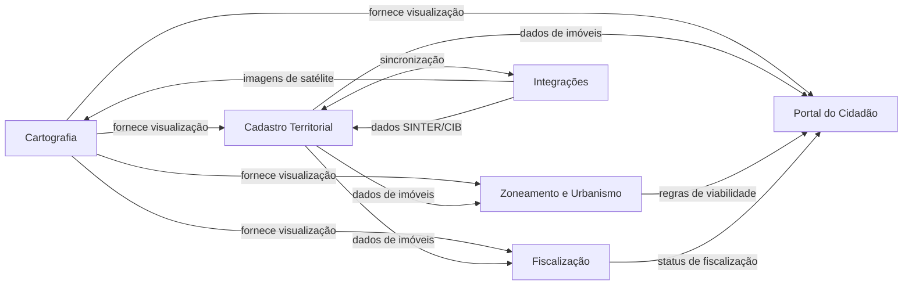

# BRD-02 — Regras de Negócio do Produto GEO

## 1. Sumário Executivo

O **GEO** é uma plataforma web de geoprocessamento voltada a prefeituras brasileiras, com custo acessível, que centraliza sobre uma base cartográfica interativa todos os dados do cadastro imobiliário municipal — imóveis edificados e terrenos baldios — identificados por inscrição e matrícula imobiliária.

O sistema permite que servidores públicos realizem manutenção cadastral, fiscalização, emissão de documentos e análises territoriais diretamente no mapa, enquanto oferece ao cidadão acesso online a certidões, consultas de débitos, viabilidade construtiva e demais serviços autorizados pela municipalidade.

**Problema central:** Municípios carecem de ferramenta acessível para trabalhar com dados territoriais de forma visual. Informações tributárias, ambientais, urbanísticas e cadastrais estão dispersas e de difícil acesso tanto para o servidor quanto para o cidadão. A plataforma unifica esses dados sobre o mapa, habilitando também processos de parcelamento de solo, gestão ambiental, saúde, educação e incorporação futura de inteligência artificial para fiscalização automatizada.

---

## 2. Objetivos de Negócio e KPIs

**Objetivo principal:** Fornecer a municípios brasileiros uma ferramenta de geoprocessamento de baixo custo que substitua processos manuais e sistemas fragmentados, aumentando a eficiência da gestão territorial e a transparência ao cidadão.

**Horizonte:** Entrega incremental — primeiro a estrutura principal do software, depois incorporação de IA e módulos complementares.

| KPI | Baseline Atual | Meta (6 meses) | Meta (12 meses) |
|-----|---------------|-----------------|------------------|
| Municípios atendidos | 0 | Piloto em 1–2 municípios | 5+ municípios em operação |
| % de imóveis consultáveis via mapa | Variável por município | 70% da base cadastral georreferenciada | 90%+ da base cadastral georreferenciada |
| Certidões emitidas online pelo cidadão | 0 | Pelo menos 3 tipos de certidão disponíveis | 6+ tipos com emissão automatizada |
| Tempo médio de consulta cadastral (servidor) | Manual / multi-sistema | Redução de 50% | Redução de 70% |

---

## 3. Legislação Aplicável ao Produto

| ID | Requisito |
|----|-----------|
| BIZ-02-001 | O sistema deve estar em conformidade com a Lei 13.709/2018 (LGPD) no tratamento de dados cadastrais de imóveis e proprietários. |
| BIZ-02-002 | O sistema deve cumprir as regras do SINTER (Sistema Nacional de Gestão de Informações Territoriais), conforme Decreto 8.764/2016, para intercâmbio de informações cadastrais territoriais com a Receita Federal. |
| BIZ-02-003 | A atribuição do CIB (Cadastro Imobiliário Brasileiro) a imóveis novos deve seguir o manual operacional do SINTER/ENAT. |
| BIZ-02-004 | O sistema deve adotar o datum geodésico oficial brasileiro SIRGAS 2000, conforme Resolução IBGE nº 1/2005. |
| BIZ-02-005 | Certidões e documentos emitidos devem atender aos requisitos legais de validade documental do município emissor. |

---

## 4. Regulamentos e Normas Aplicáveis

| ID | Requisito |
|----|-----------|
| BIZ-02-006 | Operações de parcelamento de solo (desmembramento e remembramento) devem observar a Lei 6.766/1979 (Lei de Parcelamento do Solo Urbano) e legislação municipal complementar. |
| BIZ-02-007 | Regras de zoneamento e permissibilidade devem ser configuráveis conforme o Plano Diretor e a Lei de Uso e Ocupação do Solo de cada município. |
| BIZ-02-008 | Restrições ambientais (APP, áreas de risco) devem observar o Código Florestal (Lei 12.651/2012) e normativas estaduais/municipais aplicáveis. |
| BIZ-02-009 | A solicitação e cálculo de ITBI devem respeitar a legislação tributária municipal, incluindo alíquotas, isenções e base de cálculo vigentes. |

---

## 5. Escopo

### 5.1 Incluído

- **Módulo do Servidor:** Desenho de polígonos, criação de camadas/layers com controle de visibilidade (pública, restrita, por setor), ferramentas de medição e cálculo de área, importação de KMZ/KML/Shapefile, manutenção completa do cadastro imobiliário e mobiliário (empresas), gestão de coordenadas UTM e geográficas, gestão de zoneamento e regras de permissibilidade, planta genérica de valores, fiscalização com vistorias e legendas, pontos de interesse, Street View, indicadores por bairro e exportação de dados (CSV, TXT, Excel, PDF).
- **Módulo do Cidadão:** Acesso online ao mapa com serviços configuráveis pela municipalidade (certidões de confrontação, débitos, avaliação etc.), consulta de imóveis com ou sem login (por CPF, endereço, cadastro, matrícula ou inscrição), solicitação de ITBI, interação com fiscalizações, abertura de protocolos integrados, controle de layers públicas e impressão/exportação de imagens de imóveis.
- **Integrações:** Webservices do sistema de gestão municipal (cadastro de pessoas, imóveis e empresas) e integração com o SINTER para obtenção e atualização do CIB.
- **Imagens históricas de satélite** para análise temporal (desmatamento, construções irregulares).

### 5.2 Excluído

- Execução do recadastramento imobiliário em campo (responsabilidade de empresas terceirizadas).
- Fornecimento próprio de imagens de satélite — modelo de aquisição a ser definido.
- Módulos de IA (detecção automática de construções sem alvará, aterros, desmatamentos, chatbot) — planejados para fase posterior.
- Desenvolvimento de sistema de gestão municipal (ERP tributário) — o GEO se integra a ele via webservices, não o substitui.

---

## 6. Personas / Atores do Negócio

| Persona | Descrição | Ações principais no sistema |
|---------|-----------|----------------------------|
| **Servidor Público (Cadastro/Tributário)** | Funcionário responsável pelo cadastro imobiliário/mobiliário, tributação e fiscalização | Desenhar polígonos, manter cadastro de imóveis e empresas, gerenciar zoneamento, emitir relatórios, exportar dados, fiscalizar imóveis, cadastrar vistorias |
| **Servidor Público (Urbanismo/Planejamento)** | Funcionário responsável por viabilidade construtiva, parcelamento de solo e planejamento urbano | Gerenciar regras de zoneamento e permissibilidade, analisar PGV, realizar desmembramentos/remembramentos, comparar indicadores por bairro |
| **Servidor Público (Meio Ambiente)** | Funcionário responsável por questões ambientais | Inserir restrições ambientais em imóveis, identificar áreas de APP e risco, analisar imagens históricas para detectar desmatamento |
| **Administrador do Sistema** | Responsável pela configuração da plataforma no município | Definir camadas públicas/restritas, configurar documentos disponíveis ao cidadão, gerenciar perfis de acesso por setor |
| **Cidadão (autenticado)** | Munícipe com login no sistema | Consultar seus imóveis via CPF, emitir certidões, solicitar ITBI, responder fiscalizações, abrir protocolos |
| **Cidadão (anônimo)** | Munícipe sem cadastro/login | Consultar imóveis por endereço/inscrição/matrícula, visualizar layers públicas, imprimir imagem do imóvel |

---

## 7. Presunções e Riscos

### 7.1 Presunções

| ID | Presunção |
|----|-----------|
| BIZ-02-010 | Os municípios interessados possuem ou contratarão base cartográfica georreferenciada compatível com importação no sistema (KML, Shapefile ou TXT com coordenadas em SIRGAS 2000). |
| BIZ-02-011 | Os municípios dispõem de sistema de gestão (ERP) com webservices acessíveis para integração bidirecional de dados de imóveis, pessoas e empresas. |
| BIZ-02-012 | As prefeituras designarão administradores locais capacitados para configurar camadas, documentos e perfis de acesso. |
| BIZ-02-013 | O modelo de fornecimento de imagens de satélite será definido antes do início do desenvolvimento do módulo de imagens históricas. |

### 7.2 Riscos

| ID | Risco | Impacto |
|----|-------|---------|
| BIZ-02-014 | Municípios sem base georreferenciada precisam de recadastramento prévio, o que pode atrasar a implantação. | Alto — bloqueante para uso efetivo da plataforma |
| BIZ-02-015 | Diversidade de ERPs municipais exige desenvolvimento de adaptadores específicos por município. | Médio — impacta prazo e custo de implantação |
| BIZ-02-016 | Regulamentação do SINTER ainda em evolução; mudanças nas especificações podem exigir retrabalho na integração. | Médio — impacta módulo de integração |
| BIZ-02-017 | Custo de imagens de satélite pode inviabilizar o módulo de análise temporal para municípios menores. | Médio — impacta escopo funcional |

---

## 8. Mapa de Domínios DDD (Bounded Contexts)

O sistema GEO foi decomposto nos seguintes bounded contexts:

| # | Domínio | Documento | Descrição |
|---|---------|-----------|-----------|
| 03 | Cartografia | `03_domain_cartografia_brd.md` | Motor de mapa, camadas, polígonos, medição, coordenadas, importação geoespacial, imagens de satélite e Street View |
| 04 | Cadastro Territorial | `04_domain_cadastro_territorial_brd.md` | Cadastro imobiliário e mobiliário, manutenção de propriedades, logradouros e pontos de interesse |
| 05 | Zoneamento e Urbanismo | `05_domain_zoneamento_urbanismo_brd.md` | Zoneamento, permissibilidade, parcelamento de solo, planta genérica de valores |
| 06 | Fiscalização | `06_domain_fiscalizacao_brd.md` | Fiscalização de imóveis, vistorias, legendas, indicadores e geração de documentos de fiscalização |
| 07 | Portal do Cidadão | `07_domain_portal_cidadao_brd.md` | Serviços online ao cidadão: certidões, ITBI, consultas, protocolos e interação com fiscalizações |
| 08 | Integrações | `08_domain_integracoes_brd.md` | Integração com ERP municipal, SINTER/CIB, provedores de imagem e sistemas terceiros |

### Context Map — Relações entre Domínios

**Relações principais:**

- **Cartografia** é o domínio central que fornece a camada de visualização espacial para todos os demais domínios.
- **Cadastro Territorial** é o domínio de dados mestres — imóveis e empresas são consumidos por Zoneamento, Fiscalização e Portal do Cidadão.
- **Integrações** é o domínio de fronteira que conecta o GEO a sistemas externos (ERP, SINTER, provedores de imagens).
- **Portal do Cidadão** é consumidor dos demais domínios, fornecendo a interface pública para os serviços.
