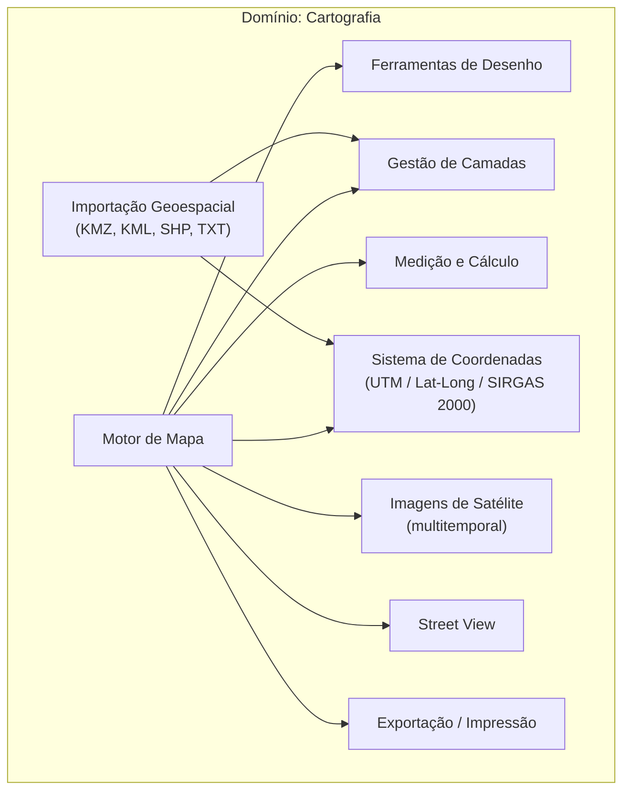

# BRD-03 — Domínio: Cartografia

## 1. Descrição do Bounded Context

O domínio **Cartografia** é o núcleo geoespacial da plataforma GEO. Responsável pelo motor de mapa interativo, gerenciamento de camadas (layers), ferramentas de desenho e medição, sistema de coordenadas, importação de arquivos geoespaciais e acesso a fontes externas de imagens (satélite e Street View).

Este domínio fornece a camada de visualização e interação espacial utilizada por todos os demais bounded contexts. Nenhum outro domínio renderiza ou manipula geometrias diretamente — todos delegam ao domínio Cartografia.

**Linguagem Ubíqua:**
- **Camada (Layer):** agrupamento lógico de elementos geoespaciais com visibilidade e permissões configuráveis.
- **Polígono:** geometria fechada que representa a delimitação espacial de um lote, zona ou área de interesse.
- **Datum:** sistema de referência geodésico; o padrão adotado é o SIRGAS 2000.
- **Base cartográfica:** conjunto de camadas que formam a representação espacial do território municipal.

---

## 2. Requisitos de Negócio

### 2.1 Motor de Mapa

| ID | Requisito |
|----|-----------|
| BIZ-03-001 | O sistema deve fornecer um mapa interativo web com funcionalidades de zoom, pan e navegação fluida sobre a base cartográfica do município. |
| BIZ-03-002 | O mapa deve suportar a exibição simultânea de múltiplas camadas sobrepostas, com controle individual de visibilidade por camada. |
| BIZ-03-003 | O sistema deve permitir a seleção de elementos no mapa (polígonos, pontos) com exibição de informações associadas (popup ou painel lateral). |

### 2.2 Desenho e Edição de Polígonos

| ID | Requisito |
|----|-----------|
| BIZ-03-004 | O sistema deve fornecer ferramentas de desenho preciso de polígonos sobre o mapa, com funcionalidades similares a ferramentas CAD (snap, alinhamento, vértices editáveis). |
| BIZ-03-005 | Deve ser possível editar polígonos existentes: mover vértices, adicionar/remover pontos, redimensionar e rotacionar. |
| BIZ-03-006 | Cada polígono deve poder ser associado a uma ou mais camadas e a entidades de outros domínios (imóvel, zona, área de fiscalização). |

### 2.3 Camadas (Layers)

| ID | Requisito |
|----|-----------|
| BIZ-03-007 | O sistema deve permitir a criação e gestão de camadas com três níveis de visibilidade: pública (visível a todos, inclusive cidadãos), privada do usuário, ou restrita a perfis/setores específicos. |
| BIZ-03-008 | Cada camada deve possuir metadados configuráveis: nome, descrição, cor/estilo de renderização, nível de zoom mínimo/máximo para exibição. |
| BIZ-03-009 | O Administrador do Sistema deve poder definir quais camadas são visíveis no Portal do Cidadão. |
| BIZ-03-010 | O sistema deve permitir ordenação (z-index) das camadas para controle de sobreposição visual. |

### 2.4 Ferramentas de Medição

| ID | Requisito |
|----|-----------|
| BIZ-03-011 | O sistema deve fornecer ferramenta de medição de distância entre dois ou mais pontos no mapa, exibindo o resultado em metros. |
| BIZ-03-012 | O sistema deve fornecer ferramenta de cálculo de área de polígonos, exibindo o resultado em metros quadrados (m²). |

### 2.5 Coordenadas e Datum

| ID | Requisito |
|----|-----------|
| BIZ-03-013 | O sistema deve suportar coordenadas no sistema UTM e em Latitude/Longitude (graus decimais). |
| BIZ-03-014 | O datum geodésico padrão deve ser SIRGAS 2000, conforme resolução IBGE. |
| BIZ-03-015 | O sistema deve exibir as coordenadas do cursor em tempo real durante navegação no mapa, com opção de alternar entre UTM e Lat/Long. |
| BIZ-03-016 | O sistema deve permitir navegação direta a um ponto por inserção de coordenadas (UTM ou Lat/Long). |

### 2.6 Importação de Arquivos Geoespaciais

| ID | Requisito |
|----|-----------|
| BIZ-03-017 | O sistema deve suportar importação de arquivos nos formatos: KMZ, KML, Shapefile (.shp + arquivos auxiliares) e TXT com coordenadas. |
| BIZ-03-018 | Na importação, o sistema deve validar o datum de origem e converter para SIRGAS 2000 quando necessário. |
| BIZ-03-019 | Arquivos importados devem gerar camadas ou polígonos editáveis dentro do sistema. |
| BIZ-03-020 | O sistema deve permitir importação em massa de coordenadas de lotes a partir de arquivos TXT estruturados. |

### 2.7 Imagens de Satélite

| ID | Requisito |
|----|-----------|
| BIZ-03-021 | O sistema deve permitir a visualização de imagens de satélite como camada de fundo do mapa. |
| BIZ-03-022 | O sistema deve suportar visualização de imagens de satélite de múltiplos períodos históricos, permitindo análise temporal (comparação entre datas). |
| BIZ-03-023 | O provedor e modelo de aquisição de imagens de satélite é externo ao sistema; o GEO consome imagens fornecidas por terceiros via API ou importação de arquivos. |

### 2.8 Street View

| ID | Requisito |
|----|-----------|
| BIZ-03-024 | O sistema deve integrar visualização Street View (Google) a partir de qualquer ponto selecionado no mapa. |
| BIZ-03-025 | O acesso ao Street View deve estar disponível tanto no módulo do servidor quanto no Portal do Cidadão. |

### 2.9 Exportação

| ID | Requisito |
|----|-----------|
| BIZ-03-026 | O sistema deve permitir a impressão e exportação de imagem do mapa (recorte da área visível ou de um imóvel específico) em formato adequado para impressão (PDF ou imagem). |

---

## 3. Personas Envolvidas

| Persona | Interação com o domínio |
|---------|------------------------|
| Servidor Público (Cadastro/Tributário) | Desenha polígonos de lotes, importa arquivos geoespaciais, navega pelo mapa para localizar imóveis |
| Servidor Público (Urbanismo/Planejamento) | Utiliza camadas de zoneamento, ferramentas de medição e análise de imagens históricas |
| Servidor Público (Meio Ambiente) | Analisa imagens históricas de satélite para detecção de desmatamento, consulta camadas ambientais |
| Administrador do Sistema | Configura camadas públicas/restritas, define estilos e visibilidade |
| Cidadão (autenticado e anônimo) | Navega no mapa, visualiza camadas públicas, utiliza Street View, imprime imagem de imóvel |

---

## 4. Presunções e Riscos

### 4.1 Presunções

- A base cartográfica (polígonos de lotes) será importada de fontes externas (recadastramento terceirizado); o GEO não produz essa base do zero.
- O município contratante possui ou contratará provedor de imagens de satélite; o GEO não fornece as imagens.
- O serviço Google Street View estará disponível via API para os municípios atendidos.

### 4.2 Riscos

- **Qualidade da base importada:** Arquivos geoespaciais de municípios podem estar em datums diferentes ou com baixa precisão, exigindo conversão e validação manual.
- **Custo de imagens de satélite:** Imagens históricas de alta resolução possuem custo significativo, podendo limitar a cobertura temporal para municípios menores.
- **Disponibilidade do Street View:** Nem todos os municípios possuem cobertura do Google Street View, especialmente áreas rurais.

---

## 5. Exemplos de Uso

**Exemplo 1 — Importação de base cartográfica:**
O servidor recebe o shapefile do recadastramento realizado por empresa terceirizada. Faz upload no sistema, que valida o datum (SIRGAS 2000), cria polígonos de lotes como camada e os associa ao cadastro imobiliário.

**Exemplo 2 — Análise temporal de satélite:**
O servidor de Meio Ambiente seleciona uma área no mapa e compara imagens de satélite de 2020 e 2024, identificando visualmente uma área desmatada que não possuía autorização.

**Exemplo 3 — Desenho de novo polígono:**
O servidor do Cadastro desenha o polígono de um lote que não constava na base importada, utilizando coordenadas UTM fornecidas em documento impresso. O sistema converte e posiciona o polígono corretamente.

---

## 6. Referências e Benchmarks

| Referência | Relevância para o domínio |
|------------|--------------------------|
| GEO Barra Velha (SC) | Interface de mapa municipal com camadas e consulta cadastral — referência de UX |
| GEO Cascavel (PR) | Visualização de lotes com ações sobre imóvel (zoom, Street View, Google Maps) |
| QGIS | Ferramenta open-source de referência para funcionalidades de desenho, medição e gestão de camadas |
| ArcGIS (Esri) | Líder de mercado em GIS — referência para funcionalidades avançadas de análise espacial |

---

## 7. Diagramas

### Componentes do Domínio Cartografia

