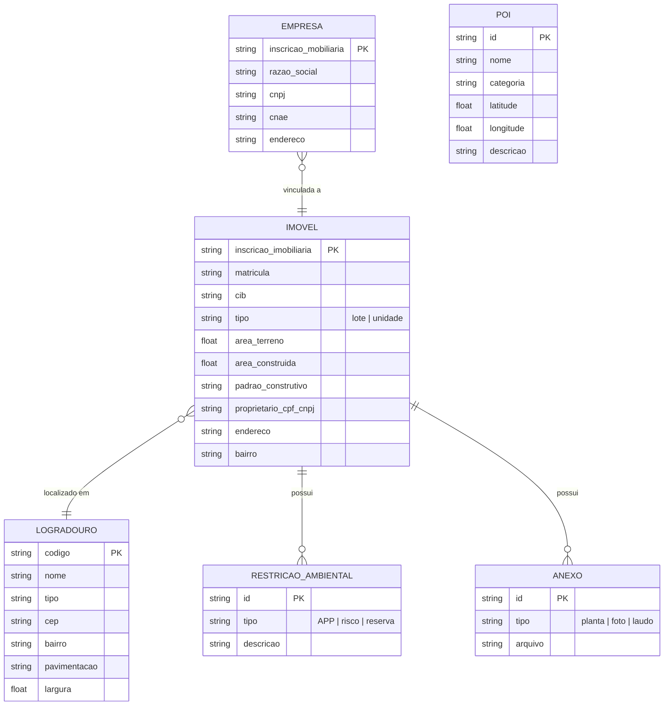

# BRD-04 — Domínio: Cadastro Territorial

## 1. Descrição do Bounded Context

O domínio **Cadastro Territorial** é responsável pela gestão dos dados mestres do cadastro imobiliário (lotes e unidades) e mobiliário (empresas) do município, bem como dos logradouros e pontos de interesse. É o domínio de dados centrais que alimenta Zoneamento, Fiscalização e Portal do Cidadão.

Toda manutenção cadastral de imóveis e empresas passa por este domínio: consulta, criação, alteração de características, propriedade, restrições, anexos e coordenadas. A interação primária ocorre a partir da seleção de um polígono no mapa (domínio Cartografia).

**Linguagem Ubíqua:**
- **Imóvel:** unidade cadastral do município, identificada por inscrição imobiliária e matrícula, podendo ser lote (terreno) ou unidade (edificação).
- **Inscrição imobiliária:** código único atribuído pelo município para identificar o imóvel no cadastro.
- **Matrícula:** número de registro do imóvel no Cartório de Registro de Imóveis.
- **Cadastro mobiliário:** registro de empresas/atividades econômicas vinculadas a um endereço ou imóvel.
- **Logradouro:** via pública (rua, avenida, travessa, etc.) com características físicas e dados de infraestrutura.
- **Ponto de interesse (POI):** localização relevante (hospital, escola, ponte, etc.) cadastrada no mapa.
- **CIB:** Cadastro Imobiliário Brasileiro — código nacional atribuído pelo SINTER.

---

## 2. Requisitos de Negócio

### 2.1 Cadastro Imobiliário

| ID | Requisito |
|----|-----------|
| BIZ-04-001 | O sistema deve permitir consulta e manutenção completa do cadastro imobiliário (lotes e unidades) a partir da seleção do polígono correspondente no mapa. |
| BIZ-04-002 | Para cada imóvel, o sistema deve armazenar e permitir edição de: características físicas (área do terreno, área construída, tipo de construção, padrão construtivo), dados de propriedade (proprietário, CPF/CNPJ), inscrição imobiliária, matrícula e CIB. |
| BIZ-04-003 | O sistema deve permitir o registro e manutenção de restrições ambientais vinculadas a imóveis (APP, área de risco, reserva legal). |
| BIZ-04-004 | O sistema deve permitir a consulta e registro de informações de viabilidade de construção do imóvel. |
| BIZ-04-005 | O sistema deve permitir anexar documentos e arquivos a um imóvel (plantas, fotos, laudos). |
| BIZ-04-006 | O sistema deve fornecer acesso às coordenadas geográficas do lote (vértices do polígono) e permitir sua exportação. |
| BIZ-04-007 | O sistema deve permitir importação em massa de coordenadas de lotes a partir de arquivos estruturados. |
| BIZ-04-008 | O sistema deve identificar cada imóvel por inscrição imobiliária e matrícula, garantindo unicidade dentro do município. |

### 2.2 Consulta e Extração de Dados

| ID | Requisito |
|----|-----------|
| BIZ-04-009 | O sistema deve permitir consulta de imóveis por múltiplos critérios: CPF/CNPJ do proprietário, endereço, número de cadastro, matrícula ou inscrição imobiliária. |
| BIZ-04-010 | O sistema deve permitir extração de imóveis individual ou por raio geográfico (selecionar um ponto e raio em metros para capturar todos os imóveis na área). |
| BIZ-04-011 | Dados extraídos devem ser exportáveis nos formatos: CSV, TXT, Excel e PDF. |
| BIZ-04-012 | A exportação deve respeitar as regras de privacidade (BIZ-01-011): dados sensíveis omitidos ou mascarados conforme perfil do usuário. |

### 2.3 Cadastro Mobiliário (Empresas)

| ID | Requisito |
|----|-----------|
| BIZ-04-013 | O sistema deve permitir consulta e manutenção do cadastro de empresas vinculadas a imóveis, acessível via mapa. |
| BIZ-04-014 | O sistema deve permitir filtro e extração de empresas por atividade econômica (CNAE ou classificação municipal). |
| BIZ-04-015 | Cada empresa deve estar associada a um endereço/imóvel no mapa. |

### 2.4 Logradouros e Infraestrutura

| ID | Requisito |
|----|-----------|
| BIZ-04-016 | O sistema deve permitir acesso e manutenção de dados de logradouros: nome, tipo (rua, avenida, etc.), CEP, bairro. |
| BIZ-04-017 | O sistema deve permitir o registro de gabarito e características da via (pavimentação, largura, iluminação, rede de água/esgoto). |

### 2.5 Pontos de Interesse

| ID | Requisito |
|----|-----------|
| BIZ-04-018 | O sistema deve permitir o cadastro de pontos de interesse (POIs) no mapa: hospitais, creches, escolas, pontes, praças e outros equipamentos públicos. |
| BIZ-04-019 | Cada POI deve possuir: nome, tipo/categoria, coordenadas e descrição. |

---

## 3. Personas Envolvidas

| Persona | Interação com o domínio |
|---------|------------------------|
| Servidor Público (Cadastro/Tributário) | Ator principal — realiza toda manutenção do cadastro imobiliário e mobiliário, importa dados, exporta relatórios |
| Servidor Público (Urbanismo/Planejamento) | Consulta dados cadastrais para análise de viabilidade e parcelamento de solo |
| Servidor Público (Meio Ambiente) | Registra e consulta restrições ambientais em imóveis |
| Administrador do Sistema | Configura regras de visibilidade de dados cadastrais |
| Cidadão (autenticado) | Consulta seus imóveis via CPF (dados fornecidos por este domínio ao Portal do Cidadão) |
| Cidadão (anônimo) | Consulta imóveis por endereço/inscrição/matrícula (dados fornecidos ao Portal do Cidadão) |

---

## 4. Presunções e Riscos

### 4.1 Presunções

- Os dados mestres de imóveis, pessoas e empresas são originados do ERP municipal e sincronizados bidirecionalmente via domínio de Integrações.
- A inscrição imobiliária é o identificador primário de cada imóvel no contexto do município; a matrícula é o identificador registral.
- Cada município define sua própria estrutura de inscrição imobiliária (formato e composição do código).

### 4.2 Riscos

- **Inconsistência entre bases:** Dados do ERP e do GEO podem divergir se a sincronização não for confiável, gerando inconsistências cadastrais.
- **Base incompleta:** Nem todos os imóveis do município possuem polígono georreferenciado na fase inicial, limitando a consulta via mapa.
- **Qualidade dos dados legados:** Dados importados do ERP podem conter duplicidades, campos vazios ou informações desatualizadas.

---

## 5. Exemplos de Uso

**Exemplo 1 — Consulta cadastral por mapa:**
O servidor clica em um polígono no mapa. O sistema exibe o painel cadastral do imóvel com todas as informações: proprietário, área, inscrição, matrícula, restrições ambientais, débitos (via integração com ERP) e fotos anexas.

**Exemplo 2 — Extração por raio:**
O servidor posiciona um ponto no centro de um bairro e define raio de 500m. O sistema lista todos os imóveis dentro dessa área. O servidor exporta a lista em Excel para análise tributária.

**Exemplo 3 — Cadastro de empresa:**
O servidor seleciona um imóvel comercial no mapa e vincula uma empresa com sua atividade econômica (CNAE). A empresa passa a ser consultável por atividade.

**Exemplo 4 — Registro de ponto de interesse:**
O servidor marca no mapa a localização de uma nova creche municipal, categoriza como "Educação" e adiciona descrição. O POI passa a ser visível na camada de equipamentos públicos.

---

## 6. Referências e Benchmarks

| Referência | Relevância para o domínio |
|------------|--------------------------|
| GEO Guarapuava (PR) | Emissão de espelho cadastral com imagem aérea e dados completos do imóvel — referência para exibição de dados cadastrais |
| GEO Barra Velha (SC) | Interface de consulta cadastral sobre mapa |
| WGeo Indaial (SC) | Consulta de imóveis e módulos de dados cadastrais |

---

## 7. Diagramas

### Entidades Principais do Cadastro Territorial

