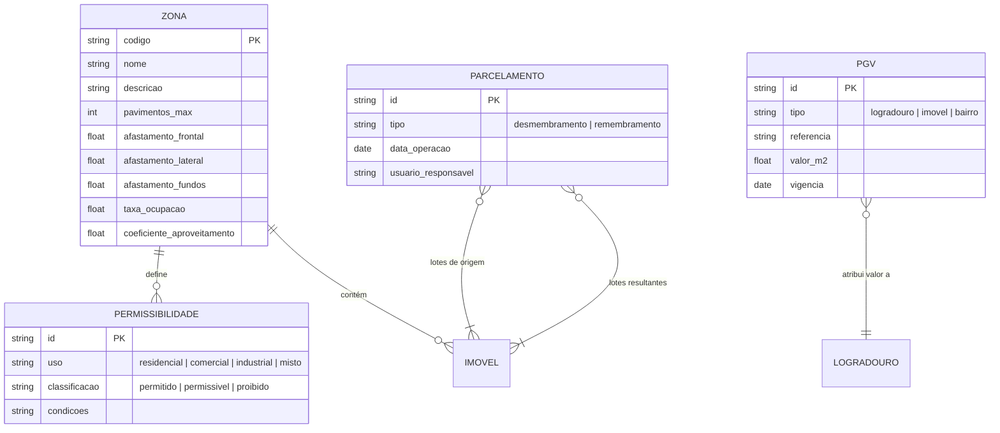
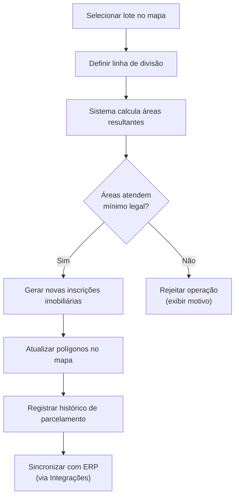

# BRD-05 — Domínio: Zoneamento e Urbanismo

## 1. Descrição do Bounded Context

O domínio **Zoneamento e Urbanismo** é responsável pela gestão das regras de uso e ocupação do solo municipal: definição de zonas, regras de permissibilidade para construção e abertura de empresas, parcelamento de solo (desmembramento e remembramento) e a Planta Genérica de Valores (PGV).

Este domínio consome dados do Cadastro Territorial (imóveis e logradouros) e fornece regras de viabilidade construtiva ao Portal do Cidadão. As regras de zoneamento são configuráveis por município, refletindo o Plano Diretor e a Lei de Uso e Ocupação do Solo local.

**Linguagem Ubíqua:**
- **Zona:** divisão territorial do município com regras específicas de uso e ocupação do solo.
- **Permissibilidade:** conjunto de regras que determinam o que pode ser construído ou instalado em uma zona (usos permitidos, permissíveis e proibidos).
- **Desmembramento:** subdivisão de um lote em dois ou mais lotes menores, sem abertura de novas vias.
- **Remembramento:** unificação de dois ou mais lotes contíguos em um único lote.
- **PGV (Planta Genérica de Valores):** tabela que atribui valor do metro quadrado (m²) a logradouros, bairros e imóveis para fins tributários.
- **Gabarito:** parâmetros urbanísticos como altura máxima, número de pavimentos e afastamentos.

---

## 2. Requisitos de Negócio

### 2.1 Gestão de Zoneamento

| ID | Requisito |
|----|-----------|
| BIZ-05-001 | O sistema deve permitir a criação e edição de zonas no mapa, associando polígonos a regras de uso e ocupação do solo. |
| BIZ-05-002 | Cada zona deve possuir regras configuráveis de: número máximo de pavimentos, afastamentos (frontal, lateral, fundos), taxa de ocupação e coeficiente de aproveitamento. |
| BIZ-05-003 | O sistema deve suportar regras de permissibilidade por zona: usos permitidos, permissíveis (sob condições) e proibidos, tanto para construção quanto para abertura de empresa. |
| BIZ-05-004 | Ao consultar um imóvel, o sistema deve exibir automaticamente a zona em que ele se encontra e as regras aplicáveis. |
| BIZ-05-005 | O sistema deve permitir a sobreposição visual de zonas no mapa com cores e legendas distintas. |

### 2.2 Parcelamento de Solo

| ID | Requisito |
|----|-----------|
| BIZ-05-006 | O sistema deve suportar operação de desmembramento: selecionar um lote e subdividi-lo em dois ou mais novos lotes, gerando novas inscrições imobiliárias. |
| BIZ-05-007 | O sistema deve suportar operação de remembramento: selecionar dois ou mais lotes contíguos e unificá-los em um único lote com nova inscrição imobiliária. |
| BIZ-05-008 | Operações de parcelamento devem respeitar as dimensões mínimas de lote definidas na legislação municipal e na Lei 6.766/1979. |
| BIZ-05-009 | O sistema deve registrar o histórico de parcelamentos (lotes de origem e lotes resultantes), mantendo rastreabilidade. |
| BIZ-05-010 | Após desmembramento ou remembramento, os polígonos no mapa devem ser atualizados automaticamente para refletir a nova configuração. |

### 2.3 Planta Genérica de Valores (PGV)

| ID | Requisito |
|----|-----------|
| BIZ-05-011 | O sistema deve permitir a atribuição de valor do m² por logradouro para fins de cálculo tributário. |
| BIZ-05-012 | O sistema deve permitir a atribuição de valor do m² por imóvel individual, quando aplicável. |
| BIZ-05-013 | O sistema deve permitir a atribuição de valor do m² por bairro como referência agregada. |
| BIZ-05-014 | O sistema deve fornecer comparativos de valores entre logradouros, bairros e imóveis para apoiar a análise da PGV. |

---

## 3. Personas Envolvidas

| Persona | Interação com o domínio |
|---------|------------------------|
| Servidor Público (Urbanismo/Planejamento) | Ator principal — gerencia zonas, regras de permissibilidade, realiza desmembramentos/remembramentos, analisa PGV |
| Servidor Público (Cadastro/Tributário) | Consulta PGV para cálculos tributários, consulta zoneamento para validar cadastro |
| Administrador do Sistema | Configura regras de zoneamento padrão do município |
| Cidadão (autenticado e anônimo) | Consulta viabilidade construtiva do imóvel via Portal do Cidadão (informação derivada das regras deste domínio) |

---

## 4. Presunções e Riscos

### 4.1 Presunções

- Cada município possui seu próprio Plano Diretor e Lei de Uso e Ocupação do Solo; as regras de zoneamento devem ser totalmente configuráveis por município.
- A PGV é atualizada periodicamente pelo município; o sistema deve suportar versionamento ou atualização em massa dos valores.
- Desmembramentos e remembramentos são operações controladas que requerem aprovação administrativa.

### 4.2 Riscos

- **Complexidade das regras municipais:** Cada município pode ter dezenas de zonas com regras distintas; a modelagem deve ser flexível o suficiente para acomodar essa variação.
- **Impacto tributário de erros na PGV:** Erros na atribuição de valores do m² impactam diretamente o cálculo de IPTU e ITBI, podendo gerar contestações judiciais.

---

## 5. Exemplos de Uso

**Exemplo 1 — Consulta de viabilidade:**
O servidor de Urbanismo seleciona um imóvel no mapa. O sistema exibe a zona (ex.: "ZR-2 — Zona Residencial 2") e as regras: máximo 2 pavimentos, afastamento frontal de 4m, usos permitidos: residencial unifamiliar e multifamiliar. O cidadão pode consultar essa mesma informação via Portal.

**Exemplo 2 — Desmembramento:**
O servidor seleciona um lote de 600m² e executa desmembramento em dois lotes de 300m². O sistema valida que 300m² atende à área mínima da zona, gera duas novas inscrições imobiliárias, desenha os novos polígonos no mapa e registra o histórico da operação.

**Exemplo 3 — Atualização da PGV:**
O servidor tributário importa nova tabela de valores do m² por logradouro. O sistema atualiza os valores e permite comparar com a tabela anterior para validação.

---

## 6. Referências e Benchmarks

| Referência | Relevância para o domínio |
|------------|--------------------------|
| WGeo Indaial (SC) | Consulta de viabilidade construtiva para o cidadão |
| GEO Guarapuava (PR) | Dados completos do imóvel incluindo informações de zoneamento |

---

## 7. Diagramas

### Relação entre Zona, Imóvel e PGV

### Fluxo de Desmembramento

