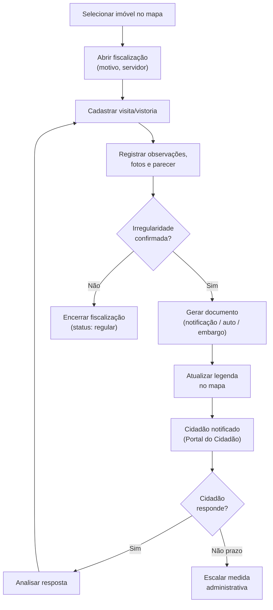
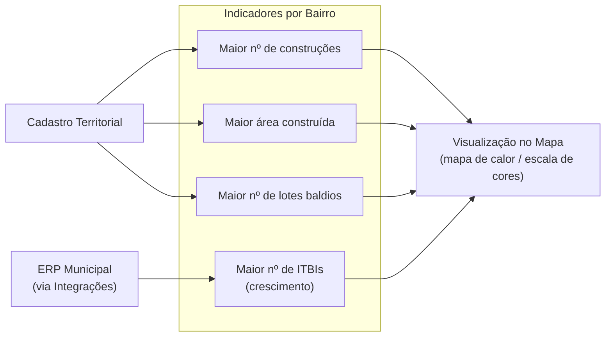

# BRD-06 — Domínio: Fiscalização

## 1. Descrição do Bounded Context

O domínio **Fiscalização** é responsável pelo processo de fiscalização de imóveis municipais: seleção de imóveis para fiscalização, registro de vistorias e visitas, geração de documentos fiscalizatórios, controle de status (legendas) e indicadores por bairro.

Este domínio consome dados do Cadastro Territorial (dados do imóvel) e da Cartografia (visualização no mapa) e fornece informações de status de fiscalização ao Portal do Cidadão (para interação do cidadão com fiscalizações).

**Linguagem Ubíqua:**
- **Fiscalização:** processo de verificação de conformidade de um imóvel com a legislação municipal (construção, uso, tributação).
- **Vistoria:** ato de inspeção presencial do imóvel, com registro de observações, fotos e parecer.
- **Visita:** ida ao local para verificação, que pode ou não resultar em vistoria formal.
- **Legenda:** classificação visual do status de fiscalização de um imóvel no mapa (ex.: fiscalizado, embargado, notificado, regular).
- **Embargo:** determinação administrativa que impede a continuidade de obra ou atividade irregular.

---

## 2. Requisitos de Negócio

### 2.1 Seleção e Abertura de Fiscalização

| ID | Requisito |
|----|-----------|
| BIZ-06-001 | O sistema deve permitir a seleção de um imóvel no mapa para abertura de processo de fiscalização. |
| BIZ-06-002 | Ao abrir uma fiscalização, o sistema deve registrar: imóvel fiscalizado, motivo, servidor responsável e data de abertura. |
| BIZ-06-003 | O sistema deve permitir a abertura de múltiplas fiscalizações por imóvel, mantendo o histórico completo. |

### 2.2 Vistorias e Visitas

| ID | Requisito |
|----|-----------|
| BIZ-06-004 | O sistema deve permitir o cadastro de vistorias vinculadas a uma fiscalização, registrando: data, servidor fiscal, observações e parecer. |
| BIZ-06-005 | O sistema deve permitir o cadastro de visitas (tentativas de contato, verificações in loco) vinculadas a uma fiscalização. |
| BIZ-06-006 | Vistorias devem permitir anexação de fotografias e documentos comprobatórios. |

### 2.3 Geração de Documentos

| ID | Requisito |
|----|-----------|
| BIZ-06-007 | O sistema deve permitir a geração de documentos de fiscalização (notificações, autos de infração, termos de embargo) a partir de templates configuráveis pelo município. |
| BIZ-06-008 | Documentos gerados devem conter dados do imóvel, proprietário, observações da vistoria e fundamentação legal. |

### 2.4 Legendas e Status

| ID | Requisito |
|----|-----------|
| BIZ-06-009 | O sistema deve atribuir legendas visuais aos imóveis no mapa conforme seu status de fiscalização: fiscalizado, embargado, notificado, regular, pendente de vistoria, entre outros. |
| BIZ-06-010 | As legendas devem ser configuráveis pelo município (cores, ícones e nomenclaturas). |
| BIZ-06-011 | O sistema deve permitir filtrar e visualizar no mapa apenas imóveis com determinada legenda de fiscalização. |

### 2.5 Indicadores

| ID | Requisito |
|----|-----------|
| BIZ-06-012 | O sistema deve fornecer indicadores por bairro: maior número de construções, maior área construída, maior número de lotes baldios. |
| BIZ-06-013 | O sistema deve fornecer indicador de maior número de ITBIs por bairro como indicador de crescimento/aquecimento imobiliário. |
| BIZ-06-014 | Os indicadores devem ser visualizáveis no mapa (ex.: mapa de calor ou escala de cores por bairro). |

---

## 3. Personas Envolvidas

| Persona | Interação com o domínio |
|---------|------------------------|
| Servidor Público (Cadastro/Tributário) | Ator principal — abre fiscalizações, registra vistorias, gera documentos, consulta legendas |
| Servidor Público (Urbanismo/Planejamento) | Consulta indicadores por bairro para planejamento urbano |
| Servidor Público (Meio Ambiente) | Abre fiscalizações ambientais (desmatamento, invasão de APP) |
| Cidadão (autenticado) | Interage com fiscalizações no Portal do Cidadão: consulta status, responde notificações, envia documentos |

---

## 4. Presunções e Riscos

### 4.1 Presunções

- O processo de fiscalização é iniciado pelo servidor e pode envolver múltiplas vistorias e documentos.
- Os documentos de fiscalização possuem requisitos legais específicos de cada município; por isso os templates devem ser configuráveis.
- Indicadores de ITBI são derivados dos dados do ERP municipal (via Integrações).

### 4.2 Riscos

- **Dados desatualizados de ITBI:** Se a integração com o ERP não for frequente, os indicadores de crescimento imobiliário podem estar defasados.
- **Validade jurídica dos documentos:** Documentos de fiscalização (autos de infração, embargos) podem ser contestados judicialmente; é crítico manter rastreabilidade e integridade dos registros.

---

## 5. Exemplos de Uso

**Exemplo 1 — Fiscalização de construção irregular:**
O servidor identifica no mapa uma área onde imagens de satélite mostram construção recente. Seleciona o imóvel, abre fiscalização com motivo "construção sem alvará", registra vistoria com fotos do local e gera notificação ao proprietário.

**Exemplo 2 — Consulta de imóveis embargados:**
O servidor de Urbanismo filtra no mapa todos os imóveis com legenda "embargado" no bairro Centro para relatório à Secretaria.

**Exemplo 3 — Indicadores de crescimento:**
O servidor de Planejamento consulta indicadores por bairro e identifica que o bairro "Jardim América" possui o maior número de ITBIs nos últimos 6 meses, indicando aquecimento imobiliário e necessidade de revisão da infraestrutura.

**Exemplo 4 — Interação do cidadão:**
O cidadão recebe notificação de fiscalização, acessa o Portal, visualiza o documento e envia resposta com documentos comprobatórios (alvará de construção regularizado).

---

## 6. Referências e Benchmarks

| Referência | Relevância para o domínio |
|------------|--------------------------|
| GEO Cascavel (PR) | Ações sobre imóvel com visualização de status |
| GEO Barra Velha (SC) | Consulta cadastral com informações de fiscalização |

---

## 7. Diagramas

### Fluxo de Fiscalização

### Indicadores por Bairro

