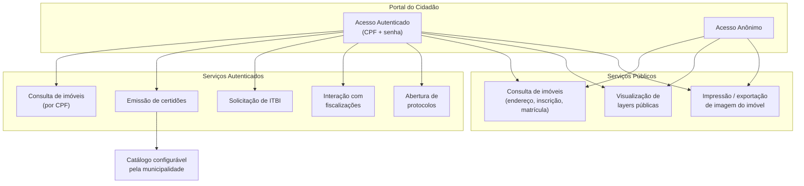
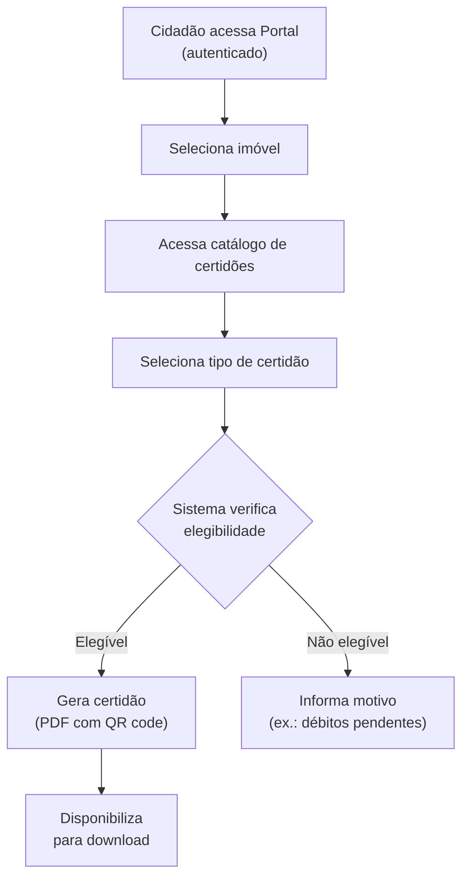

# BRD-07 — Domínio: Portal do Cidadão

## 1. Descrição do Bounded Context

O domínio **Portal do Cidadão** é responsável pela interface pública do sistema GEO, oferecendo ao munícipe acesso online a serviços cadastrais, emissão de documentos/certidões, consulta de imóveis, solicitação de ITBI, interação com fiscalizações e abertura de protocolos — tudo acessível via mapa interativo.

Este domínio é essencialmente um consumidor dos demais: obtém dados do Cadastro Territorial, regras de Zoneamento, status de Fiscalização e a camada de visualização da Cartografia. Os serviços disponibilizados são configuráveis pela municipalidade (via Administrador do Sistema), sem necessidade de desenvolvimento customizado.

**Linguagem Ubíqua:**
- **Certidão:** documento oficial emitido pelo município atestando informações sobre um imóvel (confrontação, débitos, avaliação, etc.).
- **ITBI:** Imposto sobre Transmissão de Bens Imóveis — solicitado pelo cidadão em casos de compra/venda de imóveis.
- **Protocolo:** abertura de solicitação formal pelo cidadão junto à prefeitura.
- **Serviço configurável:** funcionalidade ou documento que o Administrador do Sistema habilita ou desabilita para acesso pelo cidadão.

---

## 2. Requisitos de Negócio

### 2.1 Acesso e Autenticação

| ID | Requisito |
|----|-----------|
| BIZ-07-001 | O Portal deve ser acessível via navegador web, sem instalação de software adicional. |
| BIZ-07-002 | O Portal deve permitir acesso anônimo (sem login) para funcionalidades públicas: consulta de imóveis por endereço/inscrição/matrícula, visualização de layers públicas e impressão de imagem do imóvel. |
| BIZ-07-003 | O Portal deve permitir acesso autenticado (com login) para funcionalidades restritas: consulta de imóveis vinculados ao CPF, emissão de certidões, solicitação de ITBI, interação com fiscalizações e abertura de protocolos. |
| BIZ-07-004 | Quando logado, o sistema deve exibir automaticamente os imóveis vinculados ao CPF do cidadão no mapa. |

### 2.2 Consulta de Imóveis

| ID | Requisito |
|----|-----------|
| BIZ-07-005 | O cidadão deve poder consultar imóveis por múltiplos critérios: CPF (quando logado), endereço, número de cadastro, matrícula ou inscrição imobiliária. |
| BIZ-07-006 | Ao selecionar um imóvel, o sistema deve exibir as informações públicas autorizadas pelo município (endereço, área, zoneamento, etc.). |
| BIZ-07-007 | Informações restritas (dados de proprietário, débitos detalhados) devem ser exibidas apenas para o cidadão autenticado e vinculado ao imóvel. |

### 2.3 Emissão de Certidões e Documentos

| ID | Requisito |
|----|-----------|
| BIZ-07-008 | O sistema deve permitir a emissão online de certidões pelo cidadão, a partir de catálogo configurável pela municipalidade. |
| BIZ-07-009 | O Administrador do Sistema deve poder cadastrar e configurar os tipos de documentos/certidões emitíveis: template, dados incluídos, regras de elegibilidade e eventual taxa. |
| BIZ-07-010 | A meta é disponibilizar pelo menos 3 tipos de certidão em 6 meses e 6+ tipos em 12 meses (ex.: confrontação, débitos, avaliação, uso do solo, localização, certidão negativa). |
| BIZ-07-011 | Certidões emitidas devem possuir código de verificação de autenticidade (ex.: hash ou QR code). |

### 2.4 Solicitação de ITBI

| ID | Requisito |
|----|-----------|
| BIZ-07-012 | O cidadão autenticado deve poder solicitar ITBI online, informando dados da transação (imóvel, comprador, vendedor, valor). |
| BIZ-07-013 | O cálculo do ITBI deve aplicar as alíquotas e regras vigentes do município (BIZ-02-009). |
| BIZ-07-014 | O sistema deve gerar guia de recolhimento do ITBI para pagamento pelo cidadão. |

### 2.5 Interação com Fiscalizações

| ID | Requisito |
|----|-----------|
| BIZ-07-015 | O cidadão autenticado deve poder visualizar fiscalizações em andamento vinculadas aos seus imóveis. |
| BIZ-07-016 | O cidadão deve poder responder a notificações de fiscalização, enviando documentos e questionamentos via Portal. |

### 2.6 Abertura de Protocolos

| ID | Requisito |
|----|-----------|
| BIZ-07-017 | O cidadão deve poder abrir protocolos/solicitações junto à prefeitura via Portal. |
| BIZ-07-018 | A abertura de protocolos deve suportar integração com sistemas de protocolo terceiros, quando configurada pelo município. |

### 2.7 Camadas e Visualização

| ID | Requisito |
|----|-----------|
| BIZ-07-019 | O cidadão deve poder controlar a visibilidade das camadas (layers) públicas no mapa. |
| BIZ-07-020 | O cidadão deve poder imprimir ou exportar imagem do imóvel visualizado no mapa. |

---

## 3. Personas Envolvidas

| Persona | Interação com o domínio |
|---------|------------------------|
| Cidadão (autenticado) | Ator principal — acessa todos os serviços do Portal: consulta de imóveis via CPF, certidões, ITBI, fiscalizações, protocolos |
| Cidadão (anônimo) | Consulta imóveis por endereço/inscrição/matrícula, visualiza layers públicas, imprime imagem |
| Administrador do Sistema | Configura quais serviços e documentos estão disponíveis ao cidadão |

---

## 4. Presunções e Riscos

### 4.1 Presunções

- O catálogo de certidões e documentos é definido por cada município; o sistema fornece a infraestrutura de templates e regras, não os documentos prontos.
- A autenticação do cidadão pode ser por CPF + senha cadastrada ou integrada a sistemas de identidade do município.
- A integração com sistemas de protocolo terceiros é opcional e configurável por município.

### 4.2 Riscos

- **Adoção pelo cidadão:** A baixa familiaridade com ferramentas digitais em alguns municípios pode limitar a adoção do Portal; a interface deve ser intuitiva e acessível.
- **Autenticação e fraude:** A emissão de certidões e solicitação de ITBI exigem garantia de identidade do solicitante para evitar fraudes.
- **Disponibilidade:** O Portal é o canal público da prefeitura; indisponibilidade gera impacto direto na imagem do município.

---

## 5. Exemplos de Uso

**Exemplo 1 — Emissão de certidão de débitos:**
O cidadão acessa o Portal, faz login com CPF, seleciona seu imóvel (exibido automaticamente no mapa), clica em "Certidões" e solicita "Certidão de Débitos". O sistema verifica os dados no cadastro, gera o documento PDF com QR code de verificação e disponibiliza para download.

**Exemplo 2 — Consulta anônima:**
O cidadão acessa o Portal sem login, pesquisa um endereço, localiza o imóvel no mapa, visualiza informações públicas (área, zoneamento, confrontações) e imprime a imagem do mapa com o imóvel destacado.

**Exemplo 3 — Solicitação de ITBI:**
O cidadão autenticado acessa a área de ITBI, informa dados da compra (imóvel, valor da transação, dados do comprador e vendedor). O sistema calcula o imposto com base na alíquota municipal e na PGV, e gera a guia de pagamento.

**Exemplo 4 — Abertura de protocolo:**
O cidadão identifica uma divergência cadastral no seu imóvel. Abre protocolo via Portal descrevendo o problema e anexando documentos. O protocolo é encaminhado ao sistema de protocolo da prefeitura (se integrado) ou registrado internamente no GEO.

---

## 6. Referências e Benchmarks

| Referência | Relevância para o domínio |
|------------|--------------------------|
| WGeo Indaial (SC) | Portal do cidadão com módulos de mapa, gerador de documentos e consulta de viabilidade — principal referência para este domínio |
| GEO Guarapuava (PR) | Emissão de espelho cadastral com imagem aérea, certidões e dados completos |
| GEO Barra Velha (SC) | Interface de mapa acessível ao cidadão |
| GEO Lontras (SC) | Simplicidade de interface — referência para experiência do cidadão |

---

## 7. Diagramas

### Serviços do Portal do Cidadão

### Fluxo de Emissão de Certidão

