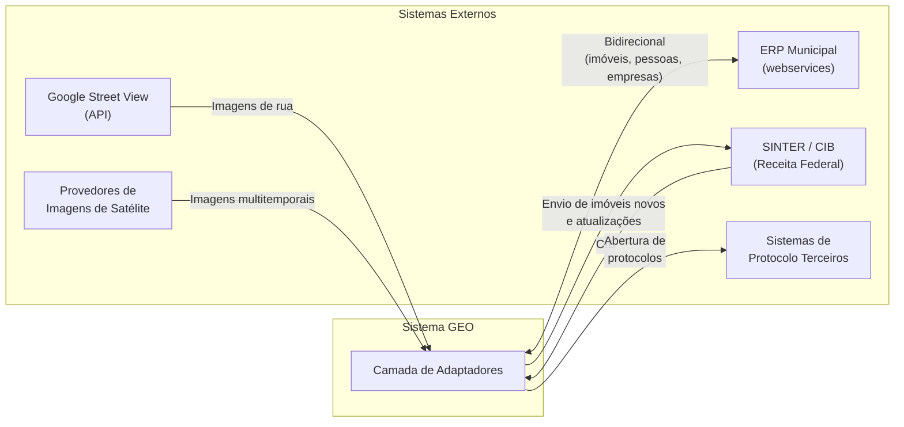
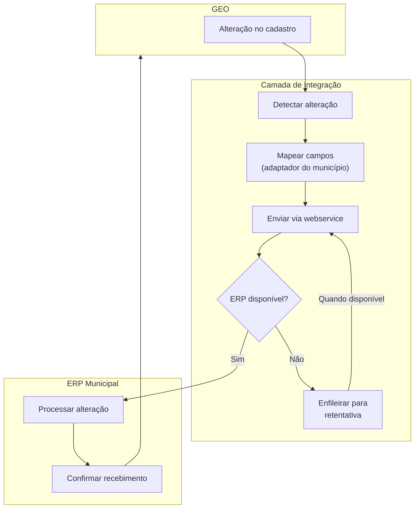

# BRD-08 — Domínio: Integrações

## 1. Descrição do Bounded Context

O domínio **Integrações** é responsável por toda comunicação entre o sistema GEO e sistemas externos: o ERP de gestão municipal, o SINTER/CIB da Receita Federal, provedores de imagens de satélite, Google Street View e sistemas de protocolo de terceiros.

Este é o domínio de fronteira (Anti-Corruption Layer) que isola os demais bounded contexts das especificidades e variações dos sistemas externos. Cada município pode possuir um ERP diferente; o domínio de Integrações abstrai essas diferenças através de adaptadores/conectores configuráveis.

**Linguagem Ubíqua:**
- **ERP Municipal:** sistema de gestão administrativa e tributária do município (ex.: gestão de IPTU, ITBI, alvará, cadastro de pessoas).
- **SINTER:** Sistema Nacional de Gestão de Informações Territoriais — plataforma da Receita Federal para centralização de dados cadastrais territoriais.
- **CIB:** Cadastro Imobiliário Brasileiro — código único nacional atribuído a cada imóvel pelo SINTER.
- **Adaptador/Conector:** componente que traduz a comunicação entre o GEO e um sistema externo específico.
- **Sincronização bidirecional:** fluxo de dados em ambas as direções (GEO → externo e externo → GEO).

---

## 2. Requisitos de Negócio

### 2.1 Integração com ERP Municipal

| ID | Requisito |
|----|-----------|
| BIZ-08-001 | O sistema deve integrar-se ao ERP de gestão municipal via webservices (API REST ou equivalente) para sincronização bidirecional de dados de imóveis, pessoas e empresas. |
| BIZ-08-002 | Inclusões e alterações de imóveis realizadas no GEO devem ser propagadas ao ERP, e vice-versa. |
| BIZ-08-003 | Inclusões e alterações de cadastro de pessoas (proprietários) devem ser sincronizadas entre GEO e ERP. |
| BIZ-08-004 | Inclusões e alterações de empresas (cadastro mobiliário) devem ser sincronizadas entre GEO e ERP. |
| BIZ-08-005 | A arquitetura de integração deve ser flexível o suficiente para conectar-se a diferentes ERPs municipais, utilizando adaptadores/conectores configuráveis por município. |
| BIZ-08-006 | Em caso de conflito de dados entre GEO e ERP, o sistema deve possuir mecanismo de resolução ou sinalização ao administrador. |
| BIZ-08-007 | A integração deve suportar operação em modo degradado: se o ERP estiver indisponível, o GEO deve continuar operando com dados locais e sincronizar quando a conexão for restabelecida. |

### 2.2 Integração com SINTER / CIB

| ID | Requisito |
|----|-----------|
| BIZ-08-008 | O sistema deve integrar-se ao SINTER conforme Decreto 8.764/2016 e manual operacional vigente. |
| BIZ-08-009 | Para imóveis novos cadastrados no GEO, o sistema deve enviar os dados ao SINTER para obtenção do CIB (Cadastro Imobiliário Brasileiro). |
| BIZ-08-010 | O sistema deve enviar atualizações cadastrais de imóveis existentes ao SINTER quando alterações relevantes forem realizadas. |
| BIZ-08-011 | O CIB obtido do SINTER deve ser armazenado no cadastro do imóvel e exibido nas consultas. |

### 2.3 Integração com Google Street View

| ID | Requisito |
|----|-----------|
| BIZ-08-012 | O sistema deve consumir a API do Google Street View para exibição de imagens de nível de rua a partir de coordenadas selecionadas no mapa. |
| BIZ-08-013 | A integração com Street View deve estar disponível nos módulos do servidor e do cidadão. |

### 2.4 Integração com Provedores de Imagens de Satélite

| ID | Requisito |
|----|-----------|
| BIZ-08-014 | O sistema deve suportar a importação de imagens de satélite de provedores externos, via API ou importação de arquivos. |
| BIZ-08-015 | O modelo de aquisição de imagens (API, importação de arquivos, provedor específico) será definido pelo contratante; o sistema deve ser flexível para acomodar diferentes modelos. |
| BIZ-08-016 | Imagens importadas devem ser georreferenciadas e compatíveis com o datum SIRGAS 2000. |

### 2.5 Integração com Sistemas de Protocolo

| ID | Requisito |
|----|-----------|
| BIZ-08-017 | O sistema deve permitir a abertura de protocolos pelo cidadão com encaminhamento para sistemas de protocolo terceiros do município. |
| BIZ-08-018 | A integração com sistemas de protocolo é opcional e configurável por município (link ou API). |

---

## 3. Personas Envolvidas

| Persona | Interação com o domínio |
|---------|------------------------|
| Administrador do Sistema | Configura conectores/adaptadores para o ERP do município, parâmetros de integração SINTER, chaves de API |
| Servidor Público (Cadastro/Tributário) | Beneficiário indireto — recebe dados sincronizados do ERP e envia alterações de volta automaticamente |
| Cidadão (autenticado) | Beneficiário indireto — protocolos abertos via Portal são encaminhados ao sistema de protocolo do município |

---

## 4. Presunções e Riscos

### 4.1 Presunções

- Todo município atendido possui ERP com webservices acessíveis para integração.
- O SINTER possui API funcional conforme manual operacional publicado pelo ENAT.
- A chave de API do Google Street View é de responsabilidade do contratante (município ou operador da plataforma).
- A integração com cada novo ERP requer desenvolvimento de adaptador específico.

### 4.2 Riscos

- **Diversidade de ERPs:** Cada município pode usar um ERP diferente (de fornecedores distintos), exigindo investimento significativo em adaptadores. Este é o principal risco deste domínio.
- **Disponibilidade de APIs externas:** Indisponibilidade do SINTER, Street View ou ERP pode degradar funcionalidades do GEO.
- **Evolução do SINTER:** O SINTER ainda está em fase de implantação nacional; mudanças na especificação podem exigir retrabalho.
- **Custos de API:** APIs externas (Google, provedores de imagem) podem ter custos por volume de requisições.

---

## 5. Exemplos de Uso

**Exemplo 1 — Sincronização de novo imóvel:**
O servidor cadastra um novo imóvel no GEO (desenha polígono, preenche dados). O domínio de Integrações envia os dados ao ERP municipal (para geração de inscrição tributária) e ao SINTER (para obtenção do CIB). Ambos retornam seus códigos, que são armazenados no cadastro.

**Exemplo 2 — Atualização bidirecional:**
O município atualiza o proprietário de um imóvel no ERP (por transferência de escritura). A integração detecta a alteração e propaga para o GEO. O mesmo ocorre no sentido inverso quando a alteração origina no GEO.

**Exemplo 3 — Configuração de novo município:**
Ao implantar o GEO em um novo município, o Administrador configura o adaptador para o ERP local (URL de webservice, credenciais, mapeamento de campos). O sistema realiza carga inicial de dados e ativa a sincronização contínua.

**Exemplo 4 — Protocolo via sistema terceiro:**
O cidadão abre protocolo no Portal do GEO. O domínio de Integrações identifica que o município possui sistema de protocolo terceiro configurado e redireciona a solicitação via API. O cidadão recebe o número de protocolo do sistema externo.

---

## 6. Referências e Benchmarks

| Referência | Relevância para o domínio |
|------------|--------------------------|
| SINTER / ENAT | Manual operacional de integração para obtenção do CIB — referência técnica obrigatória |
| Google Street View API | Documentação da API de integração para visualização de ruas |
| WGeo Indaial (SC) | Integração com protocolo e sistemas municipais |

---

## 7. Diagramas

### Mapa de Integrações

### Fluxo de Sincronização GEO-ERP

