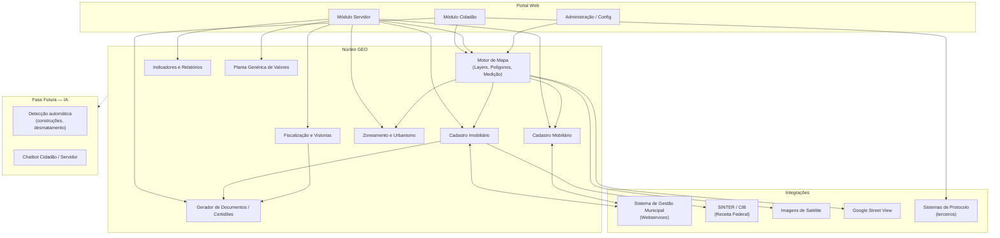
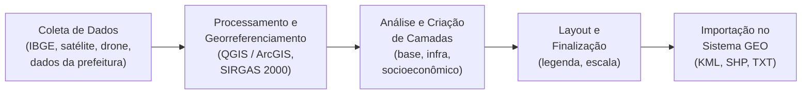

# Sumário Executivo — Sistema de Geoprocessamento Municipal (GEO)

## 1. Resumo

Plataforma web de geoprocessamento voltada a prefeituras, com custo acessível, que centraliza sobre uma base cartográfica interativa todos os dados do cadastro imobiliário municipal — imóveis edificados e terrenos baldios — identificados por inscrição e matrícula imobiliária. O sistema permite que servidores públicos realizem manutenção cadastral, fiscalização, emissão de documentos e análises territoriais diretamente no mapa, enquanto oferece ao cidadão acesso online a certidões, consultas de débitos, viabilidade construtiva e demais serviços autorizados pela municipalidade.

O problema central é que os municípios carecem de uma ferramenta acessível para trabalhar com dados territoriais de forma visual. Hoje, informações tributárias, ambientais, urbanísticas e cadastrais estão dispersas e são de difícil acesso tanto para o servidor quanto para o cidadão. A plataforma proposta unifica esses dados sobre o mapa, habilitando também processos de parcelamento de solo (desmembramento/remembramento), gestão ambiental, saúde, educação e incorporação futura de inteligência artificial para fiscalização automatizada.

## 2. Objetivos de Negócio

- **Objetivo principal:** Fornecer a municípios brasileiros uma ferramenta de geoprocessamento de baixo custo que substitua processos manuais e sistemas fragmentados, aumentando a eficiência da gestão territorial e a transparência ao cidadão.
- **Horizonte esperado:** Entrega incremental — primeiro a estrutura principal do software, depois incorporação de IA e módulos complementares.

| KPI | Baseline Atual | Meta (6 meses) | Meta (12 meses) |
|-----|---------------|-----------------|------------------|
| Municípios atendidos | 0 | Piloto em 1–2 municípios | 5+ municípios em operação |
| % de imóveis consultáveis via mapa | Variável por município | 70% da base cadastral georreferenciada | 90%+ da base cadastral georreferenciada |
| Certidões emitidas online pelo cidadão | 0 | Pelo menos 3 tipos de certidão disponíveis | 6+ tipos de certidão com emissão automatizada |
| Tempo médio de consulta cadastral (servidor) | Manual / multi-sistema | Redução de 50% | Redução de 70% |

## 3. Escopo

### 3.1 Incluído

- Módulo do servidor: desenho de polígonos, criação de camadas/layers com controle de visibilidade (pública, restrita, por setor), ferramentas de medição e cálculo de área, importação de KMZ/KML/Shapefile, manutenção completa do cadastro imobiliário e mobiliário (empresas), gestão de coordenadas UTM e geográficas, gestão de zoneamento e regras de permissibilidade, planta genérica de valores, fiscalização com vistorias e legendas, pontos de interesse, Street View, indicadores por bairro e exportação de dados (CSV, TXT, Excel, PDF).
- Módulo do cidadão: acesso online ao mapa com serviços configuráveis pela municipalidade (certidões de confrontação, débitos, avaliação etc.), consulta de imóveis com ou sem login (por CPF, endereço, cadastro, matrícula ou inscrição), solicitação de ITBI, interação com fiscalizações, abertura de protocolos integrados, controle de layers públicas e impressão/exportação de imagens de imóveis.
- Integrações: webservices do sistema de gestão municipal (cadastro de pessoas, imóveis e empresas) e integração com o SINTER para obtenção e atualização do CIB (Cadastro Imobiliário Brasileiro).
- Imagens históricas de satélite para análise temporal (desmatamento, construções irregulares).

### 3.2 Excluído (explicitamente fora do escopo)

- Execução do recadastramento imobiliário em campo (responsabilidade de empresas terceirizadas especializadas em aerofotogrametria e georreferenciamento).
- Fornecimento próprio de imagens de satélite — modelo de aquisição a ser definido.
- Módulos de IA (identificação automática de construções sem alvará, aterros, desmatamentos, chatbot para cidadão e servidor) — planejados para fase posterior, após a consolidação da estrutura principal.
- Desenvolvimento de sistema de gestão municipal (ERP tributário) — o GEO se integra a ele via webservices, não o substitui.

## 4. Atores / Personas

| Persona | Descrição | Ações principais no sistema |
|---------|-----------|----------------------------|
| **Servidor Público (Cadastro/Tributário)** | Funcionário da prefeitura responsável pelo cadastro imobiliário e mobiliário, tributação e fiscalização | Desenhar polígonos, manter cadastro de imóveis e empresas, gerenciar zoneamento, emitir relatórios, exportar dados, fiscalizar imóveis, cadastrar vistorias |
| **Servidor Público (Urbanismo/Planejamento)** | Funcionário responsável por viabilidade construtiva, parcelamento de solo e planejamento urbano | Gerenciar regras de zoneamento e permissibilidade, analisar planta genérica de valores, realizar desmembramentos/remembramentos, comparar indicadores por bairro |
| **Servidor Público (Meio Ambiente)** | Funcionário responsável por questões ambientais | Inserir restrições ambientais em imóveis, identificar áreas de APP e risco, analisar imagens históricas para detectar desmatamento |
| **Administrador do Sistema** | Responsável pela configuração da plataforma no município | Definir camadas públicas/restritas, configurar documentos disponíveis ao cidadão, gerenciar perfis de acesso por setor |
| **Cidadão (autenticado)** | Munícipe com login no sistema | Consultar seus imóveis via CPF, emitir certidões, solicitar ITBI, responder fiscalizações, abrir protocolos |
| **Cidadão (anônimo)** | Munícipe sem cadastro/login | Consultar imóveis por endereço/inscrição/matrícula, visualizar layers públicas, imprimir imagem do imóvel |

## 5. Requisitos de Aplicação (alto nível)

### 5.1 Funcionalidades Esperadas

**Mapa e Desenho**
- Desenho preciso de polígonos sobre o mapa com ferramentas similares a AutoCAD/OpenStreetMap.
- Criação e gestão de camadas (layers) com controle de permissão: pública, privada do usuário ou restrita a perfis/setores.
- Ferramentas de medição de distância e cálculo de área.
- Importação de arquivos geoespaciais: KMZ, KML, Shapefile, TXT com coordenadas.
- Suporte a coordenadas UTM e Latitude/Longitude; datum SIRGAS 2000.
- Acesso a Street View.
- Visualização de imagens de satélite de múltiplos períodos históricos.

**Cadastro Imobiliário**
- Consulta e manutenção completa do cadastro imobiliário (lotes e unidades) a partir da seleção do polígono no mapa.
- Alteração de características do imóvel, propriedade, restrições ambientais, viabilidade de construção e anexos.
- Acesso a coordenadas de lotes e possibilidade de importação em massa.
- Extração individual ou por raio de imóveis, com exportação em CSV, TXT, Excel e PDF.

**Cadastro Mobiliário (Empresas)**
- Consulta e manutenção do cadastro de empresas via mapa.
- Filtro e extração de empresas por atividade econômica.

**Zoneamento e Urbanismo**
- Gestão de zoneamentos com regras configuráveis (pavimentos, afastamentos, permissibilidade para construção e abertura de empresa).
- Parcelamento de solo: desmembramento e remembramento.
- Planta genérica de valores: atribuição de valor do m² por logradouro, imóvel e bairro, com comparativos.

**Logradouros e Infraestrutura**
- Acesso e manutenção de dados de logradouros, gabarito e características da via.
- Cadastro de pontos de interesse (hospitais, creches, pontes etc.).

**Fiscalização**
- Seleção de imóvel para fiscalização, cadastro de vistorias e visitas, geração de documentos.
- Legendas para consulta de imóveis fiscalizados, embargados etc.

**Indicadores**
- Indicadores por bairro: maior número de construções, maior área construída, maior número de lotes baldios, maior número de ITBIs (indicador de crescimento).

**Portal do Cidadão**
- Acesso online via mapa a serviços configuráveis pela municipalidade.
- Cadastro configurável de tipos de documentos/certidões emitíveis.
- Acesso com ou sem login; quando logado, exibição automática dos imóveis vinculados ao CPF.
- Solicitação de ITBI online.
- Interação com fiscalizações (respostas e questionamentos).
- Abertura de protocolos com possibilidade de integração a sistemas terceiros.
- Controle de layers/camadas públicas pelo cidadão.
- Impressão e exportação de imagem do imóvel.

### 5.2 Restrições Conhecidas

- **Dependência de dados georreferenciados:** Muitos municípios não possuem imóveis georreferenciados nem estrutura de lotes desenhada em CAD ou GEO. Será necessária contratação de empresas terceirizadas para recadastramento (coleta via satélite/drone, processamento com QGIS/ArcGIS, ajuste ao datum SIRGAS 2000).
- **Imagens de satélite:** Necessidade de definir modelo de fornecimento — aquisição própria ou terceirização, considerando que muitos concorrentes já terceirizam esse serviço.
- **Integração com sistemas legados:** Cada município pode possuir um sistema de gestão diferente, exigindo adaptadores/conectores específicos para os webservices.
- **Regulatório (SINTER):** Obrigatoriedade de integração com o Sistema Nacional de Gestão de Informações Territoriais para obtenção do CIB em novos imóveis e envio de atualizações cadastrais.

## 6. Integrações

| Sistema / API | Tipo | Direção do Fluxo | Prioridade |
|---------------|------|-------------------|------------|
| Sistema de Gestão Municipal (ERP tributário) | Webservice / API REST | Bidirecional — inclusão e alteração de imóveis, pessoas e empresas sincronizados entre GEO e ERP | Alta |
| SINTER (Receita Federal / ENAT) | API conforme manual operacional | GEO → SINTER (envio de imóveis novos para obtenção de CIB e atualizações cadastrais) | Alta |
| Google Street View | API externa | GEO ← Google (visualização) | Média |
| Provedores de imagens de satélite | A definir (API ou importação de arquivos) | Externo → GEO (importação de imagens multitemporais) | Média |
| Sistemas de protocolo terceiros | Link/API configurável por município | GEO → Sistema terceiro (abertura de protocolos pelo cidadão) | Baixa |

## 7. Referências e Benchmarks

| Software | URL / Referência | O que observar |
|----------|-----------------|----------------|
| GEO Barra Velha (SC) | https://geo.barravelha.sc.gov.br/ | Interface de mapa municipal, camadas e consulta cadastral |
| WGeo Indaial (SC) | https://indaial.wgeo.com.br/ | Portal do cidadão com módulos de mapa, gerador de documentos e consulta de viabilidade |
| GEO Lontras (SC) | https://geo.lontras.sc.gov.br/ | Simplicidade de interface e funcionalidades básicas |
| GEO Cascavel (PR) | https://geocascavel.cascavel.pr.gov.br/geo-view/index.ctm | Visualização de lotes, ações sobre imóvel (zoom, CEP, Street View, Google Maps) |
| GEO Guarapuava (PR) | https://portal.geoguarapuava.com.br/ | Emissão de espelho cadastral com imagem aérea, certidões e dados completos do imóvel |
| QGIS | https://qgis.org/ | Ferramenta open-source de referência para geoprocessamento — modelo de funcionalidades de desenho e análise |
| ArcGIS (Esri) | https://www.esri.com/arcgis/ | Líder de mercado em GIS — referência para funcionalidades avançadas |

## 8. Diagramas e Artefatos de Entrada

### Visão Geral da Arquitetura de Módulos

### Fluxo de Recadastramento (pré-requisito externo)

## 9. Restrições de Plataforma

- O sistema deve ser **web-based**, acessível via navegador tanto em desktop quanto em dispositivos móveis.
- Deve suportar o datum oficial brasileiro **SIRGAS 2000** como referência geodésica.
- Deve suportar importação dos formatos geoespaciais mais comuns: **KMZ, KML, Shapefile e TXT** com coordenadas.
- O controle de acesso deve contemplar múltiplos perfis (por setor) e permitir acesso público parcial sem autenticação.
- Certidões e documentos emitidos devem ser configuráveis pela municipalidade, sem necessidade de desenvolvimento customizado por documento.
- A arquitetura de integração deve ser flexível o suficiente para conectar-se a diferentes ERPs municipais via webservices.