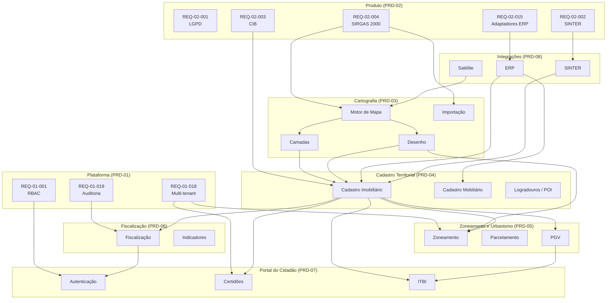

# PRD-02 — Requisitos do Produto GEO

## 1. Requisitos Regulatórios e Transversais

Estes requisitos derivam da legislação e regulamentos aplicáveis ao produto GEO e impactam múltiplos domínios simultaneamente.

---

#### REQ-02-001 — Conformidade LGPD para Dados Cadastrais
**Derives:** BIZ-02-001

**Descrição:** O tratamento de dados cadastrais de imóveis e proprietários (CPF, nome, endereço) deve estar em conformidade com a Lei 13.709/2018 (LGPD). Este requisito é transversal a todos os domínios que manipulam dados de pessoas.

**Domínios impactados:** Cadastro Territorial, Portal do Cidadão, Integrações, Fiscalização

**Critérios de aceite:**
- [ ] Toda tela que exibe dados de proprietários segue regras de mascaramento (REQ-01-012)
- [ ] Dados pessoais de proprietários são tratados conforme base legal "execução de políticas públicas" (Art. 7º, III)
- [ ] Integração com ERP transmite dados pessoais por canal criptografado
- [ ] Portal do Cidadão exibe dados de terceiros apenas quando autorizado pelo perfil

**Dependências:** `depends_on: [REQ-01-009, REQ-01-010]`

---

#### REQ-02-002 — Conformidade com SINTER
**Derives:** BIZ-02-002

**Descrição:** O sistema deve cumprir as especificações do SINTER (Decreto 8.764/2016) para intercâmbio de informações cadastrais territoriais com a Receita Federal.

**Domínios impactados:** Integrações, Cadastro Territorial

**Critérios de aceite:**
- [ ] Módulo de integração SINTER implementado conforme manual operacional vigente
- [ ] Estrutura de dados de imóvel compatível com o schema SINTER
- [ ] Logs de todas as transações com SINTER (envios e respostas)

**Dependências:** `depends_on: []`

---

#### REQ-02-003 — Atribuição de CIB via SINTER
**Derives:** BIZ-02-003

**Descrição:** Imóveis novos cadastrados no GEO devem ser submetidos ao SINTER para obtenção do CIB (Cadastro Imobiliário Brasileiro), conforme manual operacional do SINTER/ENAT.

**Use Case:**

- **Ator principal:** Sistema (automático, disparado por cadastro de imóvel)
- **Pré-condições:** Imóvel novo cadastrado com dados mínimos exigidos pelo SINTER; integração SINTER ativa.
- **Fluxo principal:**
  1. Servidor cadastra novo imóvel no sistema (via domínio Cadastro Territorial).
  2. Sistema detecta que o imóvel não possui CIB.
  3. Envia dados do imóvel ao SINTER via API.
  4. SINTER retorna o CIB atribuído.
  5. Sistema armazena o CIB no cadastro do imóvel.
- **Fluxos alternativos:**
  - 3a. SINTER indisponível → enfileira para retentativa automática.
  - 4a. SINTER rejeita dados (campos inválidos) → sinaliza erro ao servidor com detalhes.
- **Pós-condições:** CIB registrado no imóvel e visível nas consultas.
- **Exceções:**
  - Dados do imóvel incompletos para envio ao SINTER → imóvel salvo sem CIB; alerta ao servidor.

**Critérios de aceite:**
- [ ] Todo imóvel novo sem CIB é automaticamente submetido ao SINTER
- [ ] CIB retornado é armazenado e exibido no cadastro do imóvel
- [ ] Falha de comunicação resulta em retentativa automática (máx. 3 tentativas)
- [ ] Erros de validação do SINTER são exibidos ao servidor

**Dependências:** `depends_on: [REQ-02-002]`

---

#### REQ-02-004 — Adoção do Datum SIRGAS 2000
**Derives:** BIZ-02-004

**Descrição:** O datum geodésico oficial do sistema deve ser SIRGAS 2000 (Resolução IBGE nº 1/2005). Todas as coordenadas internas, importações e exportações devem operar neste referencial.

**Domínios impactados:** Cartografia, Cadastro Territorial, Integrações

**Critérios de aceite:**
- [ ] Coordenadas armazenadas internamente em SIRGAS 2000
- [ ] Importação de arquivos com outros datums realiza conversão automática
- [ ] Exportações indicam SIRGAS 2000 como referencial nos metadados
- [ ] Exibição de coordenadas no mapa utiliza SIRGAS 2000 como base

**Dependências:** `depends_on: []`

---

#### REQ-02-005 — Validade Legal de Documentos Emitidos
**Derives:** BIZ-02-005

**Descrição:** Certidões e documentos emitidos pela plataforma devem atender aos requisitos legais de validade documental do município emissor.

**Domínios impactados:** Portal do Cidadão, Fiscalização

**Critérios de aceite:**
- [ ] Documentos contêm: identificação do município, data de emissão, fundamentação legal, código de verificação de autenticidade
- [ ] Templates de documentos configuráveis por município (sem necessidade de código)
- [ ] Código de verificação permite validação online da autenticidade do documento

**Dependências:** `depends_on: []`

---

#### REQ-02-006 — Conformidade com Lei de Parcelamento do Solo
**Derives:** BIZ-02-006

**Descrição:** Operações de desmembramento e remembramento devem observar a Lei 6.766/1979 e legislação municipal complementar.

**Domínios impactados:** Zoneamento e Urbanismo, Cadastro Territorial

**Critérios de aceite:**
- [ ] Desmembramento valida dimensões mínimas de lote conforme regras configuráveis por município
- [ ] Remembramento valida limites de área máxima quando definidos
- [ ] Regras da Lei 6.766/1979 (área mínima 125m², testada mínima 5m) aplicadas como padrão, sobrescrevíveis por legislação municipal
- [ ] Operação rejeitada exibe fundamentação legal da rejeição

**Dependências:** `depends_on: []`

---

#### REQ-02-007 — Configurabilidade de Zoneamento por Município
**Derives:** BIZ-02-007

**Descrição:** As regras de zoneamento e permissibilidade devem ser configuráveis conforme o Plano Diretor e a Lei de Uso e Ocupação do Solo de cada município, sem necessidade de desenvolvimento customizado.

**Domínios impactados:** Zoneamento e Urbanismo

**Critérios de aceite:**
- [ ] Cada município pode criar, editar e excluir zonas com regras próprias
- [ ] Parâmetros configuráveis por zona: pavimentos, afastamentos, taxa de ocupação, coeficiente de aproveitamento, usos (permitido/permissível/proibido)
- [ ] Alterações de zoneamento em um município não afetam outro (isolamento multi-tenant)

**Dependências:** `depends_on: [REQ-01-018]`

---

#### REQ-02-008 — Restrições Ambientais Conforme Código Florestal
**Derives:** BIZ-02-008

**Descrição:** O registro de restrições ambientais (APP, áreas de risco, reserva legal) deve observar o Código Florestal (Lei 12.651/2012) e normativas estaduais/municipais.

**Domínios impactados:** Cadastro Territorial, Zoneamento e Urbanismo

**Critérios de aceite:**
- [ ] Tipos de restrição ambiental configuráveis: APP, risco, reserva legal, APA, outros
- [ ] Restrição vinculada ao imóvel e visível na consulta cadastral
- [ ] Restrição visível como camada no mapa com simbologia própria
- [ ] Fundamentação legal editável por tipo de restrição

**Dependências:** `depends_on: []`

---

#### REQ-02-009 — ITBI Conforme Legislação Tributária Municipal
**Derives:** BIZ-02-009

**Descrição:** A solicitação e o cálculo de ITBI devem respeitar a legislação tributária municipal, incluindo alíquotas, isenções e base de cálculo vigentes.

**Domínios impactados:** Portal do Cidadão, Zoneamento e Urbanismo (PGV)

**Critérios de aceite:**
- [ ] Alíquota de ITBI configurável por município
- [ ] Regras de isenção configuráveis (ex.: programa habitacional, transferência judicial)
- [ ] Base de cálculo: maior valor entre valor declarado e valor venal (PGV), conforme regra municipal
- [ ] Cálculo registrado com memória de cálculo auditável

| Cenário | Valor declarado | Valor venal (PGV) | Alíquota | ITBI devido |
|---------|----------------|-------------------|----------|-------------|
| Valor declarado maior | R$ 300.000 | R$ 250.000 | 2% | R$ 6.000 |
| Valor venal maior | R$ 200.000 | R$ 280.000 | 2% | R$ 5.600 |
| Isenção aplicável | R$ 150.000 | R$ 120.000 | 2% | R$ 0 (isento) |

**Dependências:** `depends_on: [REQ-01-018]`

---

## 2. Requisitos de Resiliência e Onboarding

Estes requisitos derivam das presunções e riscos identificados no BRD-02 e estabelecem capacidades que o produto deve ter para operar adequadamente em cenários reais.

---

#### REQ-02-010 — Validação de Base Cartográfica na Importação
**Derives:** BIZ-02-010

**Descrição:** O sistema deve validar a base cartográfica durante a importação, identificando problemas de datum, topologia e completude, garantindo que apenas dados em SIRGAS 2000 sejam incorporados.

**Use Case:**

- **Ator principal:** Servidor Público (Cadastro/Tributário)
- **Pré-condições:** Arquivo geoespacial disponível (KML, SHP, TXT).
- **Fluxo principal:**
  1. Servidor faz upload do arquivo.
  2. Sistema detecta datum de origem.
  3. Se datum ≠ SIRGAS 2000, sistema converte automaticamente e informa o usuário.
  4. Sistema valida topologia (polígonos fechados, sem sobreposição inválida).
  5. Exibe relatório de validação: registros válidos, convertidos, com erros.
  6. Servidor confirma importação dos registros válidos.
- **Fluxos alternativos:**
  - 2a. Datum não identificável → solicita ao servidor que informe o datum de origem.
  - 4a. Erros de topologia → lista registros com problema para correção manual.
- **Pós-condições:** Base importada com validação documentada.
- **Exceções:**
  - Formato de arquivo não suportado → erro com lista de formatos aceitos.

**Critérios de aceite:**
- [ ] Validação automática de datum com conversão para SIRGAS 2000
- [ ] Relatório de importação com contagem de: válidos, convertidos, rejeitados
- [ ] Registros rejeitados não são importados, com motivo documentado
- [ ] Importação parcial permitida (apenas registros válidos)

**Dependências:** `depends_on: [REQ-02-004]`

---

#### REQ-02-011 — Verificação de Conectividade com ERP
**Derives:** BIZ-02-011

**Descrição:** O sistema deve verificar a conectividade com o ERP municipal e informar o status ao administrador, facilitando diagnóstico de problemas de integração.

**Critérios de aceite:**
- [ ] Dashboard de status de integrações visível ao administrador
- [ ] Indicador de conectividade com ERP: online/offline/degradado
- [ ] Health check automático periódico (intervalo configurável)
- [ ] Alerta ao administrador quando ERP ficar indisponível

**Dependências:** `depends_on: []`

---

#### REQ-02-012 — Assistente de Onboarding para Administradores
**Derives:** BIZ-02-012

**Descrição:** O sistema deve fornecer assistente guiado para configuração inicial do município (onboarding), orientando o administrador local nas etapas de setup: perfis de acesso, camadas, documentos e integrações.

**Critérios de aceite:**
- [ ] Wizard de configuração inicial exibido no primeiro acesso do administrador
- [ ] Etapas: configurar perfis → importar base → configurar camadas → configurar documentos → testar integração ERP
- [ ] Checklist de progresso visível ao administrador
- [ ] Pode ser reexecutado a qualquer momento

**Dependências:** `depends_on: [REQ-01-001]`

---

#### REQ-02-013 — Abstração do Provedor de Imagens de Satélite
**Derives:** BIZ-02-013

**Descrição:** O módulo de imagens de satélite deve abstrair o provedor, permitindo que diferentes municípios utilizem diferentes fontes de imagens (API ou importação de arquivos) sem alteração de código.

**Critérios de aceite:**
- [ ] Interface de configuração para provedor de imagens por município
- [ ] Suporte a pelo menos dois modos: importação de arquivo e consumo via API
- [ ] Troca de provedor não exige redeployment

**Dependências:** `depends_on: []`

---

#### REQ-02-014 — Operação Parcial sem Base Georreferenciada Completa
**Derives:** BIZ-02-014

**Descrição:** O sistema deve operar de forma útil mesmo quando o município não possui 100% da base cadastral georreferenciada, permitindo uso progressivo conforme a base é completada.

**Critérios de aceite:**
- [ ] Imóveis sem polígono no mapa podem ser consultados por busca textual (inscrição, endereço)
- [ ] Dashboard indica % de cobertura georreferenciada da base cadastral
- [ ] Funcionalidades que dependem de mapa (medição, extração por raio) informam quando o imóvel não possui polígono
- [ ] Importação incremental: novas cargas de polígonos vinculam-se a imóveis existentes por inscrição imobiliária

**Dependências:** `depends_on: []`

---

#### REQ-02-015 — Arquitetura de Adaptadores para ERPs
**Derives:** BIZ-02-015

**Descrição:** A integração com ERPs municipais deve usar padrão de adaptadores, permitindo conectar diferentes ERPs sem alterar o núcleo do sistema.

**Critérios de aceite:**
- [ ] Interface (contrato) de integração com ERP definida e documentada
- [ ] Cada ERP é conectado via adaptador que implementa o contrato
- [ ] Novo adaptador pode ser adicionado sem alteração no código core
- [ ] Adaptador configurável por município (URL, credenciais, mapeamento de campos)

**Dependências:** `depends_on: [REQ-02-011]`

---

#### REQ-02-016 — Versionamento da Integração SINTER
**Derives:** BIZ-02-016

**Descrição:** A integração com o SINTER deve suportar versionamento, permitindo adaptar-se a mudanças na especificação sem interromper a operação.

**Critérios de aceite:**
- [ ] Versão da API SINTER configurável por instância
- [ ] Mudanças de schema compatíveis tratadas sem interrupção
- [ ] Mudanças incompatíveis geram alerta ao administrador com orientações de migração

**Dependências:** `depends_on: [REQ-02-002]`

---

#### REQ-02-017 — Módulo de Imagens de Satélite como Opcional
**Derives:** BIZ-02-017

**Descrição:** O módulo de imagens históricas de satélite deve ser opcional, permitindo que municípios com restrição de orçamento operem sem ele.

**Critérios de aceite:**
- [ ] Módulo de imagens de satélite pode ser habilitado/desabilitado por município
- [ ] Quando desabilitado, nenhuma funcionalidade dependente apresenta erro — interfaces ficam ocultas
- [ ] Habilitação não requer redeployment

**Dependências:** `depends_on: [REQ-02-013]`

---

## 3. Mapa Consolidado de Dependências entre Domínios

### 3.1 Dependências entre Domínios

### 3.2 Ordem Sugerida de Implementação

Baseado no grafo de dependências, a ordem sugerida de implementação por camada é:

| Fase | Domínios / Componentes | Justificativa |
|------|----------------------|---------------|
| **1 — Fundação** | Plataforma (RBAC, Multi-tenant, Auditoria) + SIRGAS 2000 | Infraestrutura base para todos os demais |
| **2 — Núcleo Geo** | Cartografia (Motor de Mapa, Camadas, Desenho, Importação) | Camada visual que habilita interação com todos os dados |
| **3 — Dados Mestres** | Cadastro Territorial (Imobiliário, Mobiliário, Logradouros) | Dados centrais consumidos por todos os domínios |
| **4 — Regras de Negócio** | Zoneamento e Urbanismo + Fiscalização | Dependem de Cartografia e Cadastro |
| **5 — Integrações** | ERP + SINTER | Pode iniciar em paralelo com fase 3, mas sincronização completa depende do cadastro |
| **6 — Portal Público** | Portal do Cidadão | Consumidor final; depende de todos os domínios internos |

### 3.3 Tabela de Rastreabilidade BIZ → REQ (PRD-01 e PRD-02)

| BIZ | REQ | Título |
|-----|-----|--------|
| BIZ-01-001 | REQ-01-009 | Minimização de Coleta de Dados |
| BIZ-01-002 | REQ-01-006 | Registro de Operações de Tratamento |
| BIZ-01-003 | REQ-01-006 | Registro de Operações de Tratamento |
| BIZ-01-004 | REQ-01-005 | Portal de Direitos do Titular LGPD |
| BIZ-01-005 | REQ-01-010 | Tratamento Diferenciado de Dados Sensíveis |
| BIZ-01-006 | REQ-01-002 | Gestão de Termo de Uso |
| BIZ-01-007 | REQ-01-002 | Gestão de Termo de Uso |
| BIZ-01-008 | REQ-01-002 | Gestão de Termo de Uso |
| BIZ-01-009 | REQ-01-003 | Banner de Privacidade para Acesso Anônimo |
| BIZ-01-010 | REQ-01-011 | Anonimização em Indicadores e Relatórios |
| BIZ-01-011 | REQ-01-012 | Mascaramento em Exportações de Dados |
| BIZ-01-012 | REQ-01-013 | Pseudonimização em Logs |
| BIZ-01-013 | REQ-01-004 | Página de Política de Privacidade |
| BIZ-01-014 | REQ-01-004 | Página de Política de Privacidade |
| BIZ-01-015 | REQ-01-014 | Conformidade com Licenças de Provedores Cartográficos |
| BIZ-01-016 | REQ-01-015 | Titularidade de Documentos e Dados |
| BIZ-01-017 | REQ-01-016 | Aviso Legal ao Cidadão |
| BIZ-01-018 | REQ-01-015 | Titularidade de Documentos e Dados |
| BIZ-01-019 | REQ-01-017 | Proteção contra Download em Massa |
| BIZ-01-020 | REQ-01-001 | Sistema RBAC de Controle de Acesso |
| BIZ-01-021 | REQ-01-019 | Trilha de Auditoria Imutável |
| BIZ-01-022 | REQ-01-001 | Sistema RBAC de Controle de Acesso |
| BIZ-01-023 | REQ-01-001 | Sistema RBAC de Controle de Acesso |
| BIZ-01-024 | REQ-01-018 | Isolamento Multi-tenant |
| BIZ-01-025 | REQ-01-018 | Isolamento Multi-tenant |
| BIZ-01-026 | REQ-01-019 | Trilha de Auditoria Imutável |
| BIZ-01-027 | REQ-01-007 | Interface de Consulta de Logs de Auditoria |
| BIZ-01-028 | REQ-01-020 | Backup e Recuperação |
| BIZ-01-029 | REQ-01-008 | Exportação Integral de Dados por Município |
| BIZ-02-001 | REQ-02-001 | Conformidade LGPD para Dados Cadastrais |
| BIZ-02-002 | REQ-02-002 | Conformidade com SINTER |
| BIZ-02-003 | REQ-02-003 | Atribuição de CIB via SINTER |
| BIZ-02-004 | REQ-02-004 | Adoção do Datum SIRGAS 2000 |
| BIZ-02-005 | REQ-02-005 | Validade Legal de Documentos Emitidos |
| BIZ-02-006 | REQ-02-006 | Conformidade com Lei de Parcelamento do Solo |
| BIZ-02-007 | REQ-02-007 | Configurabilidade de Zoneamento por Município |
| BIZ-02-008 | REQ-02-008 | Restrições Ambientais Conforme Código Florestal |
| BIZ-02-009 | REQ-02-009 | ITBI Conforme Legislação Tributária Municipal |
| BIZ-02-010 | REQ-02-010 | Validação de Base Cartográfica na Importação |
| BIZ-02-011 | REQ-02-011 | Verificação de Conectividade com ERP |
| BIZ-02-012 | REQ-02-012 | Assistente de Onboarding para Administradores |
| BIZ-02-013 | REQ-02-013 | Abstração do Provedor de Imagens de Satélite |
| BIZ-02-014 | REQ-02-014 | Operação Parcial sem Base Georreferenciada Completa |
| BIZ-02-015 | REQ-02-015 | Arquitetura de Adaptadores para ERPs |
| BIZ-02-016 | REQ-02-016 | Versionamento da Integração SINTER |
| BIZ-02-017 | REQ-02-017 | Módulo de Imagens de Satélite como Opcional |
