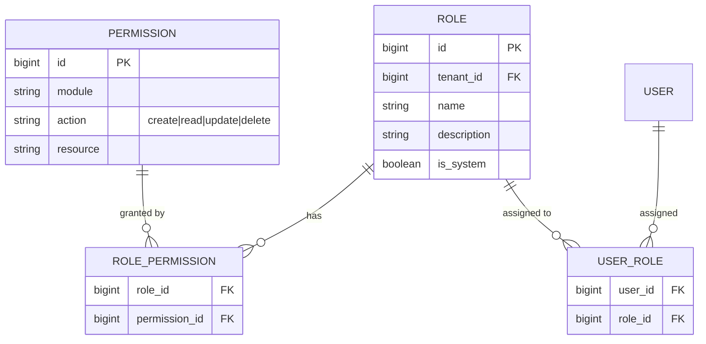
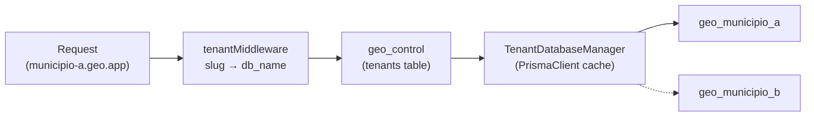

# SDD-01 — Definições de Tecnologia da Plataforma

## 1. Stack Tecnológica Imposta

### 1.1 Backend

| Componente | Tecnologia | Versão | Justificativa |
|------------|-----------|--------|---------------|
| Runtime | Node.js | 20 LTS | Suporte longo prazo, performance para I/O |
| Linguagem | TypeScript | 5.x (strict mode) | Tipagem estática, produtividade |
| Framework HTTP | Express.js | 4.x | Minimalista, maduro, ecossistema imenso |
| ORM / Migrations | Prisma | 5.x | Type-safe, migrations versionadas, suporte PostGIS via extensão |
| Validação | Zod | latest | Schemas de validação TypeScript-first, reutilizáveis entre API e frontend |
| API Docs | swagger-jsdoc + swagger-ui-express | latest | OpenAPI 3.0 gerado via anotações JSDoc nos routers |
| Autenticação | openid-client + express-session | latest | OpenID Connect (OIDC) como modelo de auth; sessões em Redis |
| Sessão / Cache | connect-redis + ioredis | latest | Sessão e cache de permissões em Redis |
| Testes Unit | Vitest | latest | Rápido, compatível com TypeScript |
| Testes E2E | Playwright | latest | Cross-browser, confiável |

### 1.2 Frontend

| Componente | Tecnologia | Versão | Justificativa |
|------------|-----------|--------|---------------|
| Build Tool | Vite | 5.x | Build rápido, HMR instantâneo |
| Linguagem | TypeScript | 5.x (strict mode) | Consistência com backend |
| UI Library | React | 18.x | Ecossistema de mapas maduro (react-leaflet) |
| Estilização | Tailwind CSS | 3.x | Utility-first, tema customizável por tenant |
| Estado global | Zustand | latest | Leve, sem boilerplate, ideal para estado de mapa |
| HTTP Client | Axios | latest | Interceptors para tenant header e cookie de sessão |
| Formulários | React Hook Form + Zod | latest | Performance, validação type-safe compartilhada com backend |
| Roteamento | React Router | 6.x | SPA routing padrão |

### 1.3 Banco de Dados e Infraestrutura

| Componente | Tecnologia | Versão | Justificativa |
|------------|-----------|--------|---------------|
| RDBMS | PostgreSQL | 16.x | Referência para geoespacial, suporte nativo a múltiplos databases |
| Extensão GIS | PostGIS | 3.4.x | Padrão da indústria para dados geoespaciais |
| Cache / Sessão | Redis | 7.x | Sessões OIDC, cache de permissões, filas |
| Fila de Jobs | BullMQ | latest | Sobre Redis, retry, prioridade, dashboard |
| File Storage | S3-compatible (MinIO self-hosted / AWS S3) | — | Armazenamento de anexos, imagens, exports |

### 1.4 Build e Ferramentas

| Componente | Tecnologia | Justificativa |
|------------|-----------|---------------|
| Package Manager | pnpm | Rápido, economiza disco |
| Lint | ESLint + Prettier | Formatação e qualidade consistentes |
| Conventional Commits | commitlint | Histórico padronizado |

---

## 2. Considerações de Deploy Obrigatórias

### 2.1 Arquitetura: Monólito Modular

A aplicação é um **monólito** com **estrutura modular mínima**. Um único processo Node.js serve a API, processa jobs e serve o frontend estático em produção.

```
geo/
├── packages/
│   ├── api/                    # Express backend (monólito)
│   │   ├── src/
│   │   │   ├── modules/        # Módulos de domínio
│   │   │   │   ├── auth/       # OIDC, sessão, RBAC
│   │   │   │   ├── cartografia/
│   │   │   │   ├── cadastro/
│   │   │   │   ├── zoneamento/
│   │   │   │   ├── fiscalizacao/
│   │   │   │   ├── portal/
│   │   │   │   └── integracoes/
│   │   │   ├── shared/         # Middleware, utils, db
│   │   │   │   ├── middleware/  # tenant, auth, audit, error
│   │   │   │   ├── database/   # Prisma client
│   │   │   │   └── config/     # Env validation (Zod)
│   │   │   ├── workers/        # BullMQ job processors
│   │   │   ├── app.ts          # Express app setup
│   │   │   └── server.ts       # HTTP server
│   │   └── prisma/
│   │       ├── schema.prisma
│   │       └── migrations/
│   └── web/                    # React SPA (Vite)
│       └── src/
│           ├── pages/
│           ├── components/
│           ├── hooks/
│           └── services/
├── docker-compose.yml
└── Dockerfile
```

Cada módulo segue a mesma estrutura interna:

```
modules/cadastro/
├── routes.ts          # Express Router com JSDoc Swagger
├── service.ts         # Lógica de negócio
├── repository.ts      # Queries Prisma
├── types.ts           # Interfaces TypeScript
└── validators.ts      # Schemas Zod
```

### 2.2 Containerização

```yaml
services:
  app:        # Express API + BullMQ workers (mesmo processo)
  web:        # Nginx servindo React SPA estático (build Vite)
  postgres:   # PostgreSQL + PostGIS
  redis:      # Sessão + cache + filas
  minio:      # S3-compatible storage (dev/self-hosted)
```

- Dockerfile multi-stage: build TypeScript → runtime `node:20-alpine`.
- Docker Compose para desenvolvimento local com hot-reload (`tsx watch`).
- Em produção, `web` é Nginx servindo o build estático do Vite.

### 2.3 Ambientes Obrigatórios

| Ambiente | Propósito | Dados |
|----------|-----------|-------|
| `development` | Desenvolvimento local (Docker Compose) | Seed fictício |
| `staging` | QA e testes de integração | Anonimizados de produção |
| `production` | Operação real | Dados reais dos municípios |

### 2.4 Variáveis de Ambiente

- Todas as configurações sensíveis via variáveis de ambiente (nunca em código).
- Schema de validação com Zod no bootstrap (`src/shared/config/env.ts`).
- Prefixo por contexto: `DB_`, `REDIS_`, `S3_`, `SINTER_`, `OIDC_`, `CF_TURNSTILE_`.

### 2.5 Migrations (Prisma)

- Toda alteração de schema via `prisma migrate dev` (development) e `prisma migrate deploy` (produção).
- Migrations versionadas e commitadas no repositório.
- Rollback via migration reversa (nova migration que desfaz a anterior).
- Seed de dados: `prisma db seed` com dados iniciais (roles, permissions, tenant demo).

---

## 3. Premissas Arquiteturais

### 3.1 Boas Práticas Obrigatórias

- **Separação em camadas:** Router → Service → Repository (nunca Prisma direto no router).
- **Modular mas monólito:** Módulos em pastas, mas tudo no mesmo processo e deployment.
- **OpenID Connect como modelo de auth:** Autenticação delegada a provedor OIDC; sessão server-side em Redis.
- **API-First:** Todos os endpoints documentados em OpenAPI/Swagger via anotações JSDoc.
- **Imutabilidade de dados de auditoria:** Tabelas de log sem permissão de UPDATE/DELETE.
- **Tenant isolation:** Cada tenant possui banco de dados PostgreSQL próprio (database-per-tenant).
- **Fail-safe integrations:** Integrações externas nunca bloqueiam a operação principal.

### 3.2 Padrão de Autenticação — OpenID Connect

```mermaid
sequenceDiagram
    participant U as Usuário
    participant SPA as React SPA
    participant API as Express API
    participant Redis as Redis (sessão)
    participant OIDC as Provedor OIDC<br/>(Gov.Br / interno)

    U->>SPA: Clicar "Entrar"
    SPA->>API: GET /auth/login
    API->>OIDC: Redirect Authorization Endpoint
    OIDC->>U: Tela de login do provedor
    U->>OIDC: Credenciais
    OIDC->>API: Callback com authorization code
    API->>OIDC: Trocar code por tokens (id_token, access_token)
    API->>API: Validar id_token, extrair claims (sub, cpf, name)
    API->>Redis: Criar sessão (sid → {user, tenant, permissions})
    API->>SPA: Set-Cookie: sid=xxx; HttpOnly; Secure
    SPA->>API: Requisições subsequentes (cookie automático)
    API->>Redis: Lookup sessão → permissões cacheadas
```

- **Provedor OIDC:** Gov.Br (cidadão) ou provedor interno compatível OIDC (servidores).
- **Sessão:** `express-session` + `connect-redis`. Cookie `HttpOnly`, `Secure`, `SameSite=Lax`.
- **Permissões:** Carregadas do banco na criação da sessão e cacheadas em Redis. TTL da sessão configurável (padrão: 30min de inatividade).
- **Logout:** Destrói sessão no Redis + redirect para `end_session_endpoint` do OIDC.

### 3.3 Documentação OpenAPI/Swagger

Todos os endpoints devem ser documentados com anotações JSDoc no router:

```typescript
/**
 * @openapi
 * /api/properties/{id}:
 *   get:
 *     tags: [Cadastro]
 *     summary: Consultar imóvel por ID
 *     parameters:
 *       - in: path
 *         name: id
 *         required: true
 *         schema:
 *           type: integer
 *     responses:
 *       200:
 *         description: Dados do imóvel
 *       404:
 *         description: Imóvel não encontrado
 */
router.get('/properties/:id', authMiddleware, propertyController.getById);
```

- `swagger-jsdoc` coleta anotações e gera spec OpenAPI 3.0.
- `swagger-ui-express` serve UI interativa em `/api/docs`.
- Spec JSON acessível em `/api/docs/json`.

### 3.4 Padrões de Commit e Branching

**Branching:** Trunk-based development com feature branches curtas.

```
main (produção)
  └── feature/REQ-03-001-mapa-interativo
  └── fix/DES-01-018-tenant-db-pool
```

**Commits:** Conventional Commits obrigatório.

```
feat(cadastro): implementar consulta multicritério [REQ-04-006]
fix(tenant): corrigir resolução de database por subdomain [DES-01-018]
```

**Merge:** Squash merge. PR obrigatório com ao menos 1 reviewer.

---

## 4. Design Técnico dos Requisitos de Plataforma

### 4.1 Gestão de Acessos e Autenticação

---

#### DES-01-001 — Sistema RBAC de Controle de Acesso
**Derives:** REQ-01-001

**Implementação:**
- Permissões definidas em tabelas: `roles`, `permissions`, `role_permissions`, `user_roles` — todas tenant-scoped.
- Middleware Express `authMiddleware`: valida sessão Redis, injeta `req.user` e `req.permissions`.
- Middleware `requirePermission('module.action')`: verifica permissão no array cacheado em Redis.
- Sessão expira por TTL do Redis (padrão: 30min inatividade, renovado a cada request).
- Role `admin_full` requer `super_admin` para ser criada (verificação no service).

**Modelo de dados:**



---

#### DES-01-002 — Gestão de Termo de Uso
**Derives:** REQ-01-002

**Implementação:**
- Tabelas: `terms_of_use` (`id`, `tenant_id`, `version`, `content` markdown, `published_at`) e `term_acceptances` (`user_id`, `term_version`, `accepted_at`, `ip_address`).
- Middleware Express `termsCheckMiddleware`: em rotas autenticadas, verifica aceite da versão corrente. Se não aceito, retorna HTTP 451 com payload `{ requiresAcceptance: true, termVersion: N }`.
- Frontend intercepta 451 via Axios interceptor e exibe modal de aceite.

---

#### DES-01-003 — Banner de Privacidade
**Derives:** REQ-01-003

**Implementação:**
- Componente React client-side puro (`CookieConsentBanner`).
- Estado em `localStorage` (key: `privacy_banner_accepted`).
- Sem dependência de backend; link para Política de Privacidade.

---

#### DES-01-004 — Página de Política de Privacidade
**Derives:** REQ-01-004

**Implementação:**
- Tabela `tenant_content`: `tenant_id`, `content_type` ("privacy_policy"), `content` (markdown), `updated_at`.
- Endpoint público: `GET /api/public/privacy-policy` (sem auth, filtrado por tenant via middleware).
- Renderização Markdown → HTML via `react-markdown` no frontend.
- Seed com template padrão; editável por tenant via admin.

---

#### DES-01-005 — Portal de Direitos do Titular LGPD
**Derives:** REQ-01-005

**Implementação:**
- Tabela `lgpd_requests`: `id`, `tenant_id`, `user_id`, `request_type` (access|correction|anonymization|deletion|portability), `status`, `created_at`, `resolved_at`, `response`.
- Endpoint cidadão: `POST /api/citizen/lgpd-requests`.
- Endpoint admin: `GET /api/admin/lgpd-requests` (fila).
- Job BullMQ `lgpd-data-export` para portabilidade (gera ZIP com dados do cidadão).

---

#### DES-01-006 — Registro de Operações de Tratamento
**Derives:** REQ-01-006

**Implementação:**
- Tabela `data_processing_records`: `id`, `tenant_id`, `operation_type`, `legal_basis`, `data_categories`, `purpose`, `timestamp`.
- Helper function `trackDataProcessing(req, legalBasis, purpose)` chamada nos services que manipulam PII.
- Exportável em CSV via endpoint admin.

---

#### DES-01-007 — Interface de Consulta de Logs de Auditoria
**Derives:** REQ-01-007

**Implementação:**
- Endpoint: `GET /api/admin/audit-logs?start=&end=&user=&action=&module=&page=&limit=`.
- Paginação cursor-based para tabelas grandes.
- Detalhe: `old_value`/`new_value` retornados como JSONB.
- Export: BullMQ job gera CSV/PDF assíncrono, notifica via WebSocket.
- Permissão: `audit.read`.

---

#### DES-01-008 — Exportação Integral de Dados
**Derives:** REQ-01-008

**Implementação:**
- BullMQ job `tenant-full-export`: `pg_dump` do database do tenant (dump completo, sem filtro necessário) + `ogr2ogr` para exportação geoespacial em formato aberto.
- Output: ZIP (SQL dump + GeoJSON + attachments do S3) → upload S3 → link temporário ao admin.
- Isolamento natural: cada tenant tem seu próprio database.

---

### 4.2 Segurança e Privacidade de Dados

---

#### DES-01-009 — Minimização de Coleta de Dados
**Derives:** REQ-01-009

**Implementação:** Constraint de design — cada campo PII documentado em `data-dictionary.yml` com finalidade. Prisma `select` nos repositories para retornar apenas campos necessários por endpoint.

---

#### DES-01-010 — Tratamento Diferenciado de Dados Sensíveis
**Derives:** REQ-01-010

**Implementação:** Campos sensíveis (CPF) criptografados via `pgcrypto` (`pgp_sym_encrypt`). Chave em variável de ambiente. Acesso requer permissão `sensitive_data.read`. Leitura gera audit log.

---

#### DES-01-011 — Anonimização em Indicadores
**Derives:** REQ-01-011

**Implementação:** Indicadores via `GROUP BY bairro` sem PII. Views materializadas para performance. Nenhum endpoint de indicadores retorna dados individuais.

---

#### DES-01-012 — Mascaramento em Exportações
**Derives:** REQ-01-012

**Implementação:**
- Middleware Express `dataMaskingMiddleware`: aplica regras de mascaramento na resposta JSON.
- Tabela `masking_rules`: `field`, `role_level` (admin|operational|public), `mask_type` (full|partial|omit).
- CPF parcial: `***.123.456-**`. Nome: exibido para operacional, omitido para público.

---

#### DES-01-013 — Pseudonimização em Logs
**Derives:** REQ-01-013

**Implementação:** Audit logs armazenam `user_id` (numérico), nunca CPF/nome. Resolução apenas via JOIN com `users`, acessível por admins com `audit.read`.

---

### 4.3 Propriedade Intelectual

---

#### DES-01-014 — Licenças de Provedores Cartográficos
**Derives:** REQ-01-014

**Implementação:** Componente `MapAttribution` exibe atribuição do provedor ativo (Leaflet `attribution` control). Tracking de tile requests por tenant.

---

#### DES-01-015 — Titularidade de Documentos
**Derives:** REQ-01-015

**Implementação:** Template Handlebars inclui `{{municipality.name}}`, `{{municipality.logo}}`, `{{platform.name}}` no rodapé. Dados de `tenant_config`.

---

#### DES-01-016 — Aviso Legal ao Cidadão
**Derives:** REQ-01-016

**Implementação:** Texto legal incluído no Termo de Uso (DES-01-002), Política de Privacidade (DES-01-004) e rodapé de documentos exportados (DES-01-015).

---

#### DES-01-017 — Proteção contra Download em Massa
**Derives:** REQ-01-017

**Implementação:** `express-rate-limit` nos endpoints de tiles/imagens: máx. 100 req/min por IP. Sem API de download de tiles em lote. Export limitado a viewport atual.

---

### 4.4 Infraestrutura e Governança

---

#### DES-01-018 — Isolamento Multi-tenant
**Derives:** REQ-01-018

**Implementação — Database-per-tenant:**

Cada tenant possui seu próprio banco de dados PostgreSQL + PostGIS. Um banco de controle central (`geo_control`) gerencia o registro de tenants e suas configurações.

```
PostgreSQL Server
├── geo_control          # Banco de controle (catálogo de tenants)
│   ├── tenants          # id, slug, name, db_name, db_host, status
│   ├── tenant_config    # configurações JSONB por tenant
│   └── global_settings  # configurações globais da plataforma
├── geo_municipio_a      # Banco do tenant A (todas as tabelas de domínio)
├── geo_municipio_b      # Banco do tenant B
└── geo_municipio_c      # Banco do tenant C
```

- **Resolução de tenant:** Middleware Express `tenantMiddleware` extrai slug do subdomain (`{slug}.geo.app`), consulta `geo_control.tenants` para obter `db_name`, e resolve a instância PrismaClient correspondente.
- **Pool de conexões:** `TenantDatabaseManager` mantém cache de PrismaClient por tenant (lazy-init, LRU eviction para tenants inativos). Cada PrismaClient aponta para o database do tenant.
- **Novo tenant (onboarding):** `CREATE DATABASE geo_{slug} TEMPLATE geo_template` — database template contém schema vazio com PostGIS habilitado e migrations aplicadas.
- **Migrations:** Script utilitário `migrate-all-tenants.ts` itera sobre `geo_control.tenants` e executa `prisma migrate deploy` em cada banco.
- **Isolamento total:** Nenhuma tabela de domínio possui coluna `tenant_id`; isolamento é a nível de database.
- **Configurações por tenant:** Tabela `tenant_config` em `geo_control` (JSONB): provedor de mapa, API keys, alíquotas, templates, features.



---

#### DES-01-019 — Trilha de Auditoria Imutável
**Derives:** REQ-01-019

**Implementação:**
- Tabela `audit_logs` no database de cada tenant: `id`, `user_id`, `timestamp` (UTC), `action_type`, `entity_type`, `entity_id`, `old_value` (JSONB), `new_value` (JSONB).
- Sem coluna `tenant_id` (isolamento já garantido a nível de database).
- DB role da aplicação tem `INSERT` only nesta tabela; sem `UPDATE`/`DELETE`.
- Middleware Express `auditMiddleware`: intercepta mutations (POST/PUT/PATCH/DELETE); services chamam `auditService.log()` com valores anterior/posterior.
- Retenção: particionamento por mês; drop de partições após período legal (default: 5 anos).

---

#### DES-01-020 — Backup e Recuperação
**Derives:** REQ-01-020

**Implementação:**
- Backup por tenant: `pg_dump` individual de cada database de tenant (permite restore independente).
- Backup global: `pg_basebackup` diário do servidor inteiro (fallback).
- WAL archiving para S3 (point-in-time recovery).
- RPO ≤ 24h, RTO ≤ 4h.
- Restore de tenant individual possível sem afetar outros tenants.
- Script de restore automatizado + teste trimestral documentado em runbook.
