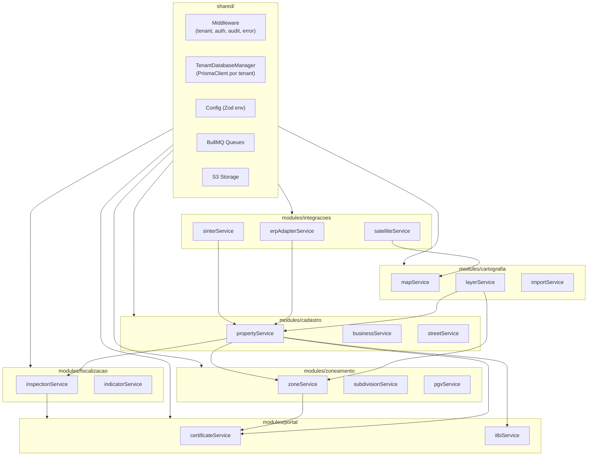
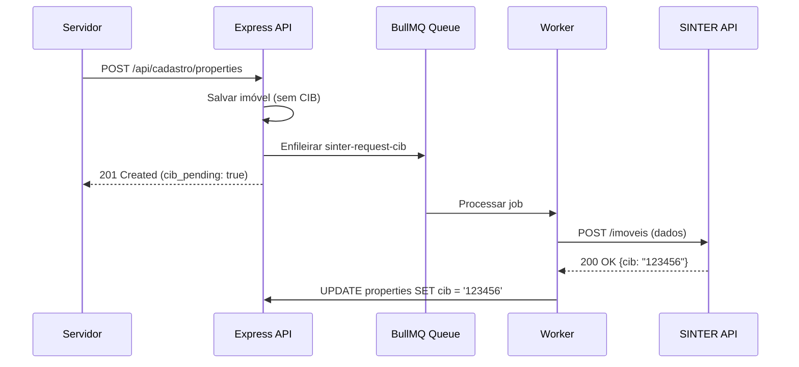
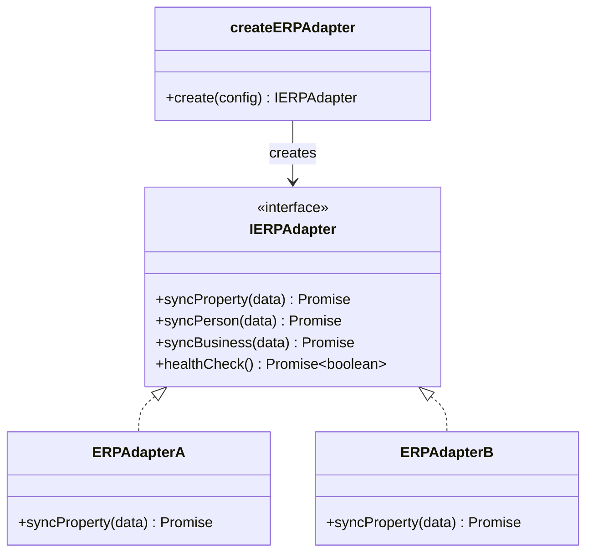

# SDD-02 — Definições de Tecnologia do Produto GEO

## 1. Estrutura de Domínios

### 1.1 Bounded Contexts — Módulos do Monólito

O GEO é uma **aplicação monolítica com estrutura modular mínima**. Cada bounded context é um diretório dentro de `src/modules/` com seus próprios routers, services e repositories. Todos rodam no mesmo processo Node.js. A instância PrismaClient é resolvida dinamicamente por tenant via `TenantDatabaseManager` (cada tenant possui seu próprio banco de dados).

| Módulo | Bounded Context | Responsabilidade |
|--------|-----------------|-----------------|
| `modules/auth` | Autenticação e Autorização | OIDC, sessão Redis, RBAC, permissões |
| `modules/cartografia` | Cartografia | Motor de mapa, camadas, desenho, coordenadas, importação |
| `modules/cadastro` | Cadastro Territorial | Imóveis, empresas, logradouros, POIs |
| `modules/zoneamento` | Zoneamento e Urbanismo | Zonas, permissibilidade, parcelamento, PGV |
| `modules/fiscalizacao` | Fiscalização | Fiscalizações, vistorias, legendas, indicadores |
| `modules/portal` | Portal do Cidadão | Certidões, ITBI, protocolos, auth cidadão |
| `modules/integracoes` | Integrações | ERP, SINTER, Street View, satélite, protocolo |
| `shared/` | Compartilhado | Middleware, Prisma client, config, utils |

### 1.2 Estrutura Interna de Cada Módulo

```
modules/cadastro/
├── routes.ts          # Express Router + anotações @openapi
├── service.ts         # Lógica de negócio
├── repository.ts      # Queries Prisma
├── types.ts           # Interfaces e DTOs TypeScript
└── validators.ts      # Schemas Zod (input validation)
```

- **routes.ts** registra rotas no Express Router e valida input via Zod antes de chamar o service.
- **service.ts** contém lógica de negócio e orquestra chamadas a repositories (próprio ou de outros módulos).
- **repository.ts** encapsula queries Prisma. Nunca usado diretamente por routes.
- Módulos podem importar services de outros módulos diretamente (monólito — sem barreira de rede).

### 1.3 Context Map



### 1.4 Registro de Rotas (app.ts)

```typescript
// src/app.ts — registro centralizado
import express from 'express';
import { tenantMiddleware } from './shared/middleware/tenant';
import { sessionMiddleware } from './shared/middleware/session';
import { errorHandler } from './shared/middleware/error';

import { cartografiaRoutes } from './modules/cartografia/routes';
import { cadastroRoutes } from './modules/cadastro/routes';
import { zoneamentoRoutes } from './modules/zoneamento/routes';
import { fiscalizacaoRoutes } from './modules/fiscalizacao/routes';
import { portalRoutes } from './modules/portal/routes';
import { integracoesRoutes } from './modules/integracoes/routes';
import { authRoutes } from './modules/auth/routes';

const app = express();
app.use(express.json());
app.use(sessionMiddleware);   // express-session + connect-redis
app.use(tenantMiddleware);    // resolve tenant_id
app.use('/api/auth', authRoutes);
app.use('/api/cartografia', cartografiaRoutes);
app.use('/api/cadastro', cadastroRoutes);
app.use('/api/zoneamento', zoneamentoRoutes);
app.use('/api/fiscalizacao', fiscalizacaoRoutes);
app.use('/api/portal', portalRoutes);
app.use('/api/integracoes', integracoesRoutes);
app.use(errorHandler);
```

---

## 2. Stack do Produto

### 2.1 Mapa e Geoespacial

| Biblioteca | Uso | Justificativa |
|-----------|-----|---------------|
| Leaflet 1.9.x + react-leaflet 4.x | Mapa interativo (provedor padrão) | Open-source, leve, ecossistema de plugins |
| MapLibre GL JS | Renderer alternativo (via adapter) | WebGL, performance para grandes datasets |
| Leaflet.draw + Leaflet.snap | Desenho de polígonos com snap | Ferramentas CAD-like sobre Leaflet |
| turf.js | Cálculos geoespaciais client-side | Área, distância, buffer, interseção |
| proj4js | Conversão coordenadas UTM ↔ Lat/Long | Suporte SIRGAS 2000 (EPSG:4674) |
| GDAL (via Docker sidecar ou child_process) | Conversão de datum, importação SHP/KML | Referência para transformação geoespacial |
| @tmcw/togeojson | Parsing KML/KMZ → GeoJSON | Leve, sem deps nativas |
| shpjs | Parsing Shapefile → GeoJSON | Client ou server-side |

### 2.2 Documentos e Exportação

| Biblioteca | Uso | Justificativa |
|-----------|-----|---------------|
| Puppeteer | Geração PDF a partir de HTML | Fidelidade visual, CSS completo |
| Handlebars | Templates de documentos/certidões | Lógica mínima, seguro, configurável |
| qrcode | QR codes de verificação | Leve, PNG e SVG |
| exceljs | Exportação Excel (.xlsx) | Streaming, baixo uso de memória |
| papaparse | Exportação/importação CSV | Rápido, streaming |

### 2.3 Autenticação e Segurança

| Biblioteca | Uso | Justificativa |
|-----------|-----|---------------|
| openid-client | Client OIDC (Gov.Br e provedores internos) | Lib certificada OpenID Foundation, suporta discovery |
| express-session | Gerenciamento de sessão server-side | Padrão Express; cookie HttpOnly/Secure |
| connect-redis + ioredis | Store de sessão em Redis | Sessão compartilhável, expirável, escalável |
| @cloudflare/turnstile | Captcha widget | SDK oficial, zero-friction |

### 2.4 Integrações

| Biblioteca | Uso | Justificativa |
|-----------|-----|---------------|
| axios + axios-retry | HTTP client para APIs externas | Interceptors, retry com backoff exponencial |
| p-queue | Controle de concorrência | Evita sobrecarga de APIs externas |
| node-cron | Agendamento de health checks e syncs periódicos | Simples, no-process-fork |

---

## 3. Considerações de Deploy do Produto

### 3.1 Multi-tenancy — Database-per-tenant

- **Estratégia:** Um banco de dados PostgreSQL + PostGIS por tenant (isolamento total a nível de database). Banco de controle `geo_control` para catálogo de tenants e configurações.
- **Resolução de tenant:** Subdomain (`{slug}.geo.app`) → lookup em `geo_control.tenants` → `TenantDatabaseManager` resolve PrismaClient apontando para o database do tenant.
- **Configurações por tenant:** Tabela `tenant_config` em `geo_control` (JSONB): provedor de mapa, API keys, alíquotas, templates, features habilitadas.
- **Provisioning:** Novo tenant criado via `CREATE DATABASE geo_{slug} TEMPLATE geo_template`.
- **Migrations:** Utilitário `migrate-all-tenants.ts` aplica `prisma migrate deploy` em todos os databases.
- **Tabelas de domínio não possuem coluna `tenant_id`** — isolamento é por database.

### 3.2 Processamento Assíncrono

Filas BullMQ (Redis) para operações pesadas — processadas no mesmo processo via `worker.ts`:

| Fila | Uso | Prioridade |
|------|-----|-----------|
| `import-geospatial` | Importação de SHP/KML/TXT | Normal |
| `generate-document` | Certidões e documentos (Puppeteer) | Alta |
| `sync-erp` | Sincronização bidirecional com ERP | Normal |
| `sync-sinter` | Envio de dados ao SINTER | Normal |
| `export-data` | Exportação CSV/Excel/PDF em massa | Baixa |

### 3.3 Armazenamento de Arquivos

- **Anexos:** S3 → `/{tenant_id}/attachments/{property_id}/{uuid}.{ext}`
- **Documentos:** S3 → `/{tenant_id}/documents/{type}/{uuid}.pdf`
- **Satélite:** S3 → `/{tenant_id}/satellite/{date}/{tile}.tif`
- **Exports:** S3 → `/{tenant_id}/exports/{uuid}.zip` (TTL 24h)

---

## 4. Design Patterns

### 4.1 Patterns Permitidos

| Pattern | Quando usar |
|---------|-------------|
| **Repository** | Acesso a dados; toda query Prisma encapsulada no repository |
| **Adapter** | Integrações externas: ERPs, SINTER, provedores de mapa/satélite |
| **Strategy** | Provedores plugáveis: mapa, satélite, cálculo de ITBI |
| **Factory** | Criação de entidades complexas (lotes resultantes de parcelamento) |
| **Event Emitter** | Comunicação entre módulos: `propertyCreated` → sync SINTER/ERP |
| **Middleware Chain** | Cross-cutting: tenant, auth, audit, rate-limit, error handling |
| **Specification** | Regras de negócio complexas: validação de parcelamento, elegibilidade |

### 4.2 Patterns Proibidos

| Pattern | Justificativa |
|---------|---------------|
| **Active Record** | Mistura persistência com domínio; usar Repository + Prisma |
| **God Object/Service** | Services > 500 linhas devem ser decompostos |
| **Callback Hell** | Usar async/await em todos os fluxos assíncronos |
| **Global State Mutable** | Estado global somente via Redis (sessão/cache) ou Zustand (frontend) |
| **SQL direto em routes** | Toda query passa pelo repository; nunca Prisma no router |

---

## 5. Code Smells a Evitar

| Code Smell | Descrição | Como detectar |
|-----------|-----------|---------------|
| **N+1 Queries** | Loop executando query por iteração | Prisma logging em dev; alertar se >10 queries/request |
| **Fat Routes** | Lógica de negócio no arquivo de rotas | ESLint rule: route handlers < 15 linhas; delegar ao service |
| **Tenant Leak** | Request usando PrismaClient de tenant errado | Teste automatizado: verificar que middleware resolve database correto por subdomain |
| **Raw SQL sem parameterização** | SQL injection | Proibir `$queryRawUnsafe` sem revisão |
| **Hardcoded Config** | Config que deveria estar em `tenant_config` ou env | Code review checklist |
| **Sync pesado** | Operação >2s no request lifecycle | Threshold: mover para fila BullMQ |
| **Import circular** | Módulos com dependência circular | `madge --circular` no CI |
| **Secrets em código** | API keys, senhas hardcoded | git-secrets + ESLint rule |

---

## 6. Design Técnico dos Requisitos do Produto

### 6.1 Conformidade Regulatória

---

#### DES-02-001 — Conformidade LGPD para Dados Cadastrais
**Derives:** REQ-02-001

**Implementação:** Reutiliza mecanismos da plataforma (DES-01-009 a DES-01-013). CPF criptografado via `pgcrypto`. Comunicação com ERP via TLS 1.3. Services que manipulam PII chamam `trackDataProcessing(req, 'public_policy', 'cadastro_imobiliario')`.

---

#### DES-02-002 — Conformidade com SINTER
**Derives:** REQ-02-002

**Implementação:** `modules/integracoes/sinterService.ts` implementa interface `ISinterClient`. Schema mapping configurável (GEO → SINTER payload). Client HTTP com `axios-retry` (3x, backoff exponencial). Transações logadas em `integration_logs`.

---

#### DES-02-003 — Atribuição de CIB via SINTER
**Derives:** REQ-02-003

**Implementação:**
- EventEmitter: `propertyService.emit('propertyCreated', property)` → listener enfileira job `sinter-request-cib`.
- Worker BullMQ processa: monta payload → envia ao SINTER → armazena CIB em `properties.cib`.
- Retry: 3x com backoff (1min, 5min, 15min).
- Falha permanente: `cib_pending = true` no imóvel; lista de pendências para admin.



---

#### DES-02-004 — Adoção do Datum SIRGAS 2000
**Derives:** REQ-02-004

**Implementação:**
- PostGIS SRID 4674 (SIRGAS 2000) para todas as colunas `geometry`.
- Prisma: `geometry Unsupported("geometry(Polygon, 4674)")`.
- Importação: GDAL `ogr2ogr -t_srs EPSG:4674` para conversão.
- Frontend: `proj4js` para exibição UTM (zona detectada pela longitude).

---

#### DES-02-005 — Validade Legal de Documentos
**Derives:** REQ-02-005

**Implementação:**
- Templates Handlebars em `document_templates` (tenant_id, type, template_html, variables).
- Geração: Puppeteer renderiza HTML → PDF.
- Código de verificação: `HMAC-SHA256(doc_id + tenant_id + timestamp, SECRET)`, 12 chars.
- Endpoint público: `GET /api/public/verify/:code` → metadados do documento.
- QR code via `qrcode` apontando para URL de verificação.

---

### 6.2 Regulamentos Configuráveis

---

#### DES-02-006 — Conformidade Parcelamento de Solo
**Derives:** REQ-02-006

**Implementação:** `subdivisionService.validate()` com Specification pattern: `MinAreaSpec(zone.min_area ?? 125)`, `MinFrontageSpec(zone.min_frontage ?? 5)`. Regras em `zone_rules`. Validação antes de persistir.

---

#### DES-02-007 — Zoneamento Configurável por Município
**Derives:** REQ-02-007

**Implementação:** Tabelas no database do tenant: `zones` (código, nome, geometria), `zone_rules` (parâmetros), `zone_permissibilities` (uso, classificação, condições). CRUD no admin. Query espacial: `ST_Contains(zone.geom, property.geom)`.

---

#### DES-02-008 — Restrições Ambientais
**Derives:** REQ-02-008

**Implementação:** Tabela `environmental_restrictions`: `property_id`, `restriction_type` (enum configurável por tenant), `description`, `legal_basis`, `created_by`, `created_at`. Badge no cadastro + camada no mapa.

---

#### DES-02-009 — ITBI Conforme Legislação Municipal
**Derives:** REQ-02-009

**Implementação:**
- Tabela `itbi_config` (no database do tenant): `rate`, `base_calc_rule`, `exemptions` (JSONB).
- `itbiService.calculate(declaredValue, assessedValue, tenantConfig)`.
- Memória de cálculo em JSONB no registro de solicitação.

---

### 6.3 Resiliência e Onboarding

---

#### DES-02-010 — Validação de Base Cartográfica
**Derives:** REQ-02-010

**Implementação:**
- `importService.validate()`: detecta datum via `.prj` (SHP) ou heurísticas.
- Conversão GDAL (`ogr2ogr`) via `child_process.execFile`.
- `ValidationReport`: `{ total, valid, converted, rejected, errors[] }`.
- Job BullMQ `import-geospatial` para arquivos grandes.

---

#### DES-02-011 — Verificação de Conectividade com ERP
**Derives:** REQ-02-011

**Implementação:**
- `integrationHealthService`: health check via `node-cron` a cada 5min.
- Tabela `integration_status` (no database do tenant): `provider`, `status`, `last_check`, `last_error`.
- Endpoint admin: `GET /api/admin/integration-status`.
- WebSocket push ao admin quando status muda.

---

#### DES-02-012 — Assistente de Onboarding
**Derives:** REQ-02-012

**Implementação:**
- Tabela `onboarding_progress` (em `geo_control`): `tenant_id`, `step`, `completed`, `completed_at`.
- Steps: `configure_roles` → `import_base` → `configure_layers` → `configure_documents` → `test_erp`.
- Componente React `<OnboardingWizard />` com stepper.
- Exibido se `tenant_config.onboarding_completed = false`.

---

#### DES-02-013 — Abstração do Provedor de Imagens de Satélite
**Derives:** REQ-02-013

**Implementação:**
- Interface `ISatelliteProvider`: `getAvailableImages(bbox, dateRange)`, `getImage(id)`.
- Implementações: `FileImportProvider`, `APIProvider`.
- Config por tenant em `tenant_config.satellite_provider`.
- Factory resolve provider no runtime (Strategy pattern).

---

#### DES-02-014 — Operação Parcial sem Base Georreferenciada
**Derives:** REQ-02-014

**Implementação:**
- `geometry` nullable em `properties`: imóveis sem polígono consultáveis por texto.
- Dashboard coverage: `COUNT(geometry IS NOT NULL) * 100.0 / COUNT(*)`.
- Importação incremental: `UPSERT` por `inscricao_imobiliaria`.

---

#### DES-02-015 — Arquitetura de Adaptadores para ERPs
**Derives:** REQ-02-015

**Implementação:**
- Interface `IERPAdapter`: `syncProperty()`, `syncPerson()`, `syncBusiness()`, `healthCheck()`.
- Cada ERP: classe que implementa a interface.
- Config por tenant: `erp_adapter_config` (`adapter_type`, `base_url`, `credentials`, `field_mapping` JSONB).
- Factory: `createERPAdapter(config)` → resolve implementação.



---

#### DES-02-016 — Versionamento da Integração SINTER
**Derives:** REQ-02-016

**Implementação:**
- Config: `sinter_api_version` em config global ou `tenant_config`.
- `sinterService` carrega schema de mapeamento conforme versão.
- Schemas versionados: `sinter-schema-v1.json`, `sinter-schema-v2.json`.
- Mudanças breaking: alerta no admin + flag para ativar nova versão.

---

#### DES-02-017 — Módulo de Imagens de Satélite como Opcional
**Derives:** REQ-02-017

**Implementação:**
- Feature flag: `tenant_config.features.satellite_module = true|false`.
- Backend: rotas de satélite verificam flag via middleware; retornam 404 se desabilitado.
- Frontend: `useTenantFeature('satellite_module')` hook → renderização condicional.
