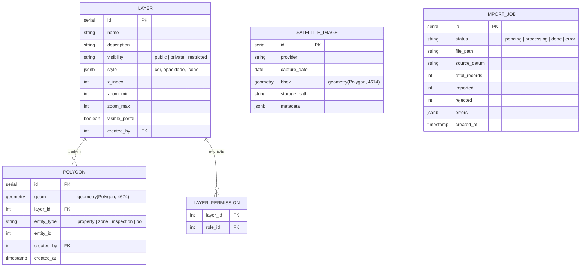
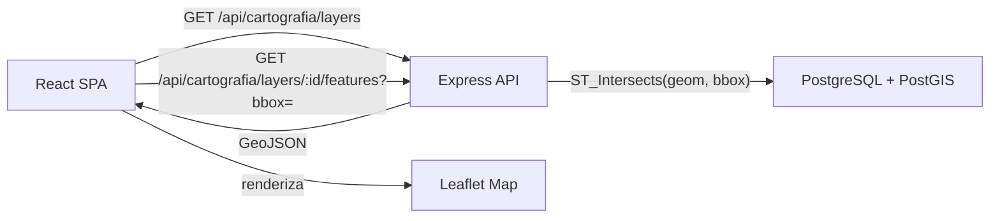
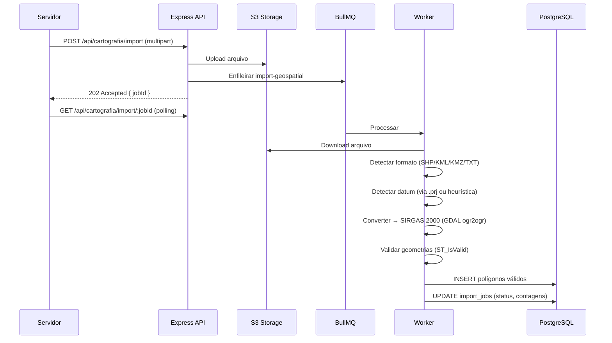

# SDD-03 — Domínio: Cartografia

## 1. Modelo de Dados do Domínio

> Tabelas no database do tenant (sem `tenant_id`). Geometrias em SRID 4674 (SIRGAS 2000).

---

## 2. Design Técnico

### 2.1 Motor de Mapa

---

#### DES-03-001 — Mapa Interativo Web
**Derives:** REQ-03-001

**Visão geral:** SPA React renderiza mapa via react-leaflet. Backend fornece dados via GeoJSON endpoints. Camadas carregadas sob demanda conforme viewport (bounding box).

**Arquitetura:**

- **Frontend:** Componente `<MapContainer>` (react-leaflet) com hooks `useMapLayers()`, `useMapClick()`.
- **Backend:** `GET /api/cartografia/layers/:id/features?bbox=xmin,ymin,xmax,ymax` retorna GeoJSON filtrado por viewport.
- **Performance:** Simplificação de geometrias via `ST_SimplifyPreserveTopology` para zoom levels baixos.

**Segurança:** Camadas restritas filtradas pelo middleware `authMiddleware` + verificação de `layer_permissions` por role.

---

#### DES-03-002 — Provedores de Mapa Plug-and-Play
**Derives:** REQ-03-002

**Visão geral:** Abstração `MapProviderAdapter` no frontend permite trocar tile layer base sem alterar componentes. Config por tenant em `geo_control.tenant_config`.

**Implementação:**
- Interface `IMapProvider`: `getTileUrl()`, `getAttribution()`, `getMaxZoom()`.
- Implementações: `OpenStreetMapProvider` (padrão, sem API key), `GoogleMapsProvider`, `MapboxProvider`, `ArcGISProvider`, `MapLibreProvider`.
- `useMapProvider()` hook: lê config do tenant via API → resolve provider → injeta tile layer no Leaflet.
- Validação de API key: `POST /api/cartografia/map-provider/validate` testa requisição ao provedor.
- Fallback: se provedor configurado falhar, reverte para OSM/Leaflet automaticamente.

**Endpoint admin:**
- `GET /api/admin/map-provider` — config atual
- `PUT /api/admin/map-provider` — atualizar provedor + API key
- `POST /api/admin/map-provider/validate` — testar chave

---

#### DES-03-003 — Desenho e Edição de Polígonos
**Derives:** REQ-03-003

**Visão geral:** Leaflet.draw + Leaflet.snap para ferramentas de desenho CAD-like. Polígonos validados no backend antes de persistir.

**Frontend:**
- Plugin `Leaflet.draw` configurado com snap a vértices vizinhos (tolerância 10px).
- Guias de alinhamento via `Leaflet.Snap` (snap a edges e vértices de polígonos visíveis).
- Undo/redo via stack de operações em Zustand.
- Cálculo de área em tempo real via `turf.area()`.

**Backend:**
- `POST /api/cartografia/polygons` — cria polígono (body: GeoJSON + layer_id + entity_type + entity_id).
- `PUT /api/cartografia/polygons/:id` — edita geometria.
- Validação server-side: `ST_IsValid(geom)` e `NOT ST_IsSelfIntersecting(geom)`.
- Erro 422: `{ error: "INVALID_GEOMETRY", detail: "Polígono contém autointerseção" }`.

**Segurança:** Requer permissão `cartografia.polygon.write`.

---

#### DES-03-004 — Associação de Polígonos a Entidades
**Derives:** REQ-03-004

**Implementação:**
- Tabela `polygons` possui `entity_type` (enum: property, zone, inspection, poi) e `entity_id` (FK lógica).
- Um polígono pode pertencer a múltiplas camadas via `polygon_layers` (tabela N:N).
- Associação validada: `entity_id` deve existir na tabela correspondente ao `entity_type`.
- Remoção de associação não exclui polígono nem entidade.

---

### 2.2 Camadas

---

#### DES-03-005 — Gestão de Camadas
**Derives:** REQ-03-005

**Implementação:**
- CRUD: `POST/GET/PUT/DELETE /api/cartografia/layers`.
- Visibilidade: `public` (todos, inclusive portal), `private` (só o criador), `restricted` (roles específicas via `layer_permissions`).
- `visible_portal`: boolean que controla se aparece no Portal do Cidadão.
- Reordenação: `PATCH /api/cartografia/layers/reorder` com body `[{ id, z_index }]`.
- Nome único por tenant: constraint `UNIQUE(name)` no database.

**Segurança:** CRUD requer `cartografia.layer.admin`. Leitura de camadas respeita visibilidade + role do usuário.

---

### 2.3 Medição e Coordenadas

---

#### DES-03-006 — Ferramentas de Medição
**Derives:** REQ-03-006

**Implementação:** 100% client-side via turf.js.
- Distância: `turf.length(lineString, { units: 'meters' })`.
- Área: `turf.area(polygon)` retorna m².
- UI: Componente `<MeasureTool>` com toggle distância/área, exibição em overlay no mapa.
- Sem persistência — ferramenta auxiliar.

---

#### DES-03-007 — Sistema de Coordenadas
**Derives:** REQ-03-007

**Implementação:**
- Datum interno: SRID 4674 (SIRGAS 2000 / Lat-Long).
- Display UTM: `proj4js` converte 4674 → UTM (zona detectada pela longitude do centro do mapa).
- Componente `<CoordinateDisplay>` no rodapé: exibe coordenadas do cursor em tempo real.
- Toggle UTM ↔ Lat/Long persistido em `localStorage`.
- "Ir para coordenada": modal com input, parseia ambos os formatos, `map.flyTo()`.
- Validação de formato: regex + `proj4.forward()` com try/catch.

---

### 2.4 Importação e Integração

---

#### DES-03-008 — Importação de Arquivos Geoespaciais
**Derives:** REQ-03-008

**Visão geral:** Upload de arquivo → job BullMQ `import-geospatial` → parsing + validação datum + conversão SIRGAS 2000 → criação de polígonos/camada.

**Arquitetura:**

- **Parsers:** `shpjs` (SHP), `@tmcw/togeojson` (KML/KMZ), parser customizado (TXT coordenadas).
- **Conversão datum:** GDAL `ogr2ogr` via `child_process.execFile` — `-t_srs EPSG:4674`.
- **Resultado:** `import_jobs` com contagens (total, imported, rejected) + array de erros.

---

#### DES-03-009 — Visualização de Imagens de Satélite
**Derives:** REQ-03-009

**Implementação:**
- Tabela `satellite_images`: metadados (provider, capture_date, bbox, storage_path).
- Frontend: `<SatelliteLayer>` componente Leaflet que renderiza imagem como tile overlay.
- Seletor de período: `GET /api/cartografia/satellite/dates?bbox=` → lista datas disponíveis.
- Comparação temporal: componente `<SatelliteCompare>` com slider side-by-side (leaflet-side-by-side).
- Feature flag: `tenant_config.features.satellite_module` controla visibilidade.

---

#### DES-03-010 — Integração Street View
**Derives:** REQ-03-010

**Implementação:**
- Frontend: `<StreetViewPanel>` embarca Google Street View Embed API via iframe.
- Coordenadas passadas como parâmetros: `https://www.google.com/maps/embed/v1/streetview?location={lat},{lng}&key={apiKey}`.
- API key carregada de `tenant_config.google_streetview_key`.
- Se key não configurada: botão "Street View" oculto.
- Se sem cobertura: Google API retorna fallback; painel exibe mensagem.

---

### 2.5 Exportação

---

#### DES-03-011 — Exportação e Impressão de Mapa
**Derives:** REQ-03-011

**Implementação:**
- Frontend: `leaflet-image` ou `html2canvas` captura viewport do mapa como PNG.
- PDF: canvas PNG + legenda + cabeçalho municipal → montado com `jsPDF` client-side.
- Modo "imóvel específico": highlight do polígono + zoom automático antes da captura.
- Sem tráfego de tiles para o backend — captura 100% client-side.
