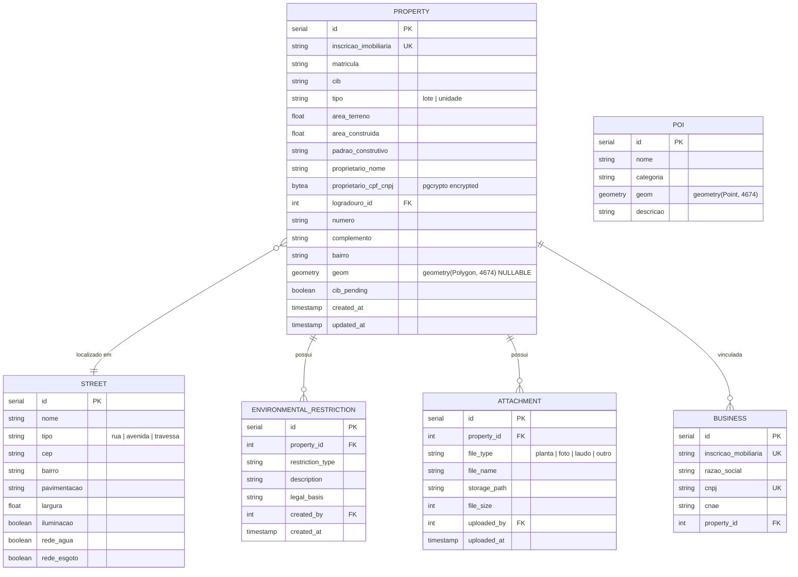

# SDD-04 — Domínio: Cadastro Territorial

## 1. Modelo de Dados do Domínio

> Tabelas no database do tenant. `proprietario_cpf_cnpj` criptografado via `pgcrypto`. `geom` nullable para imóveis sem polígono.

---

## 2. Design Técnico

### 2.1 Cadastro Imobiliário

---

#### DES-04-001 — Manutenção do Cadastro Imobiliário
**Derives:** REQ-04-001

**Visão geral:** CRUD de imóveis acessível via seleção de polígono no mapa ou busca textual. CPF criptografado em repouso.

**Endpoints:**
- `GET /api/cadastro/properties/:id` — consulta completa
- `POST /api/cadastro/properties` — criar imóvel (opcionalmente com geometria)
- `PUT /api/cadastro/properties/:id` — atualizar campos
- `GET /api/cadastro/properties/by-polygon/:polygonId` — consulta via clique no mapa

**Validações (Zod):**
- `inscricao_imobiliaria`: string, obrigatório, unique por database
- `proprietario_cpf_cnpj`: validação de CPF/CNPJ via algoritmo de dígitos verificadores
- `area_terreno`, `area_construida`: number positivo
- `tipo`: enum `['lote', 'unidade']`

**Segurança:**
- Escrita: `cadastro.property.write`
- CPF criptografado: `pgp_sym_encrypt(cpf, env.ENCRYPTION_KEY)` no repository
- Toda alteração gera audit log via `auditService.log()`

---

#### DES-04-002 — Restrições Ambientais em Imóveis
**Derives:** REQ-04-002

**Implementação:**
- `POST /api/cadastro/properties/:id/restrictions` — adicionar restrição
- `DELETE /api/cadastro/properties/:id/restrictions/:rid` — remover (com justificativa no body)
- Tipos configuráveis: seed inicial com APP, risco, reserva legal; admin pode adicionar novos.
- Remoção registra justificativa em `audit_logs`.
- Frontend: badge colorido na ficha do imóvel + camada visual no mapa (via `entity_type = 'restriction'`).

---

#### DES-04-003 — Viabilidade de Construção
**Derives:** REQ-04-003

**Implementação:**
- `GET /api/cadastro/properties/:id/viability` — compila automaticamente:
  - Zona do imóvel (query `ST_Contains` em `zones`)
  - Regras de permissibilidade da zona
  - Restrições ambientais do imóvel
- `POST /api/cadastro/properties/:id/viability` — registrar parecer de viabilidade (texto + servidor).
- Tabela `viability_reports`: `property_id`, `zone_info` (JSONB snapshot), `restrictions` (JSONB), `parecer`, `created_by`, `created_at`.

---

#### DES-04-004 — Gestão de Anexos de Imóvel
**Derives:** REQ-04-004

**Implementação:**
- `POST /api/cadastro/properties/:id/attachments` — multipart upload → S3 → registro em `attachments`.
- `GET /api/cadastro/properties/:id/attachments` — lista anexos.
- `GET /api/cadastro/attachments/:aid/download` — signed URL do S3 (TTL 15min).
- Limites: 20MB por arquivo. Formatos: PDF, JPG, PNG, DWG, DXF.
- Storage path: `/{tenant_slug}/attachments/{property_id}/{uuid}.{ext}`.

---

#### DES-04-005 — Coordenadas e Importação em Massa de Lotes
**Derives:** REQ-04-005

**Implementação:**
- `GET /api/cadastro/properties/:id/coordinates` — retorna vértices do polígono em Lat/Long e UTM.
- `GET /api/cadastro/properties/:id/coordinates/export?format=csv|txt` — exporta coordenadas.
- Importação em massa: `POST /api/cadastro/properties/import-coordinates` → BullMQ job que:
  1. Parseia TXT com colunas `inscricao_imobiliaria, x1, y1, x2, y2, ...`
  2. Constrói polígonos e vincula a `properties` existentes por inscrição.
  3. Relatório: importados, sem correspondência, com erro.

---

### 2.2 Consulta e Extração

---

#### DES-04-006 — Consulta Multicritério de Imóveis
**Derives:** REQ-04-006

**Implementação:**
- `GET /api/cadastro/properties/search?q=&field=cpf|endereco|cadastro|matricula|inscricao&page=&limit=`
- Busca por endereço: `ILIKE '%termo%'` ou PostgreSQL Full-Text Search (tsvector em `endereco_completo`).
- Busca por CPF: decrypt + compare (pesado) → alternativa: armazenar hash do CPF para busca indexada.
- Resultado inclui flag `has_geometry` para o frontend saber se pode centralizar no mapa.

---

#### DES-04-007 — Extração por Raio e Exportação
**Derives:** REQ-04-007

**Implementação:**
- `GET /api/cadastro/properties/by-radius?lat=&lng=&radius=&format=json|csv|xlsx|pdf`
- Query: `ST_DWithin(geom, ST_SetSRID(ST_MakePoint(lng, lat), 4674), radius_meters)`.
- Limite de raio: 5000m (configurável).
- Exportação aplica `dataMaskingMiddleware` conforme role do usuário.
- Para CSV/XLSX/PDF: job BullMQ `export-data` gera arquivo assíncrono → download via S3 signed URL.

---

### 2.3 Cadastro Mobiliário e Infraestrutura

---

#### DES-04-008 — Cadastro Mobiliário
**Derives:** REQ-04-008

**Implementação:**
- CRUD: `/api/cadastro/businesses` vinculado a `property_id`.
- `GET /api/cadastro/businesses?cnae=&q=` — filtro por CNAE (código ou descrição via ILIKE).
- CNPJ com constraint unique no database.
- Endpoint bulk: `GET /api/cadastro/businesses/export?cnae=&format=csv|xlsx`.

---

#### DES-04-009 — Manutenção de Logradouros
**Derives:** REQ-04-009

**Implementação:**
- CRUD: `/api/cadastro/streets`.
- Busca: `GET /api/cadastro/streets/search?q=` com autocomplete (ILIKE + LIMIT 10).
- Campos de infraestrutura: pavimentação, largura, iluminação, rede de água/esgoto (boolean + enum).

---

#### DES-04-010 — Pontos de Interesse
**Derives:** REQ-04-010

**Implementação:**
- CRUD: `/api/cadastro/pois`.
- Geometria: `Point(4674)` registrada automaticamente a partir de coordenadas do clique no mapa.
- Categorias configuráveis: tabela `poi_categories` (nome, ícone).
- Camada: POIs exibidos em camada dedicada com ícone por categoria (Leaflet `L.divIcon`).
