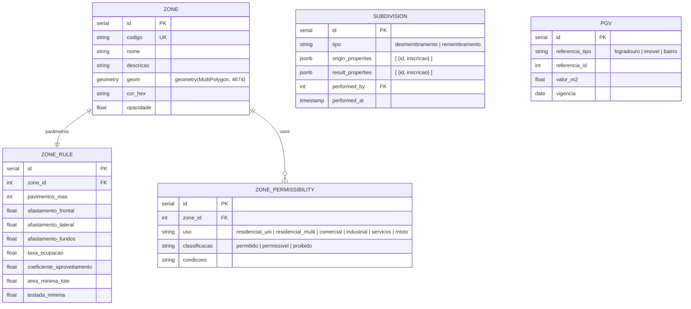
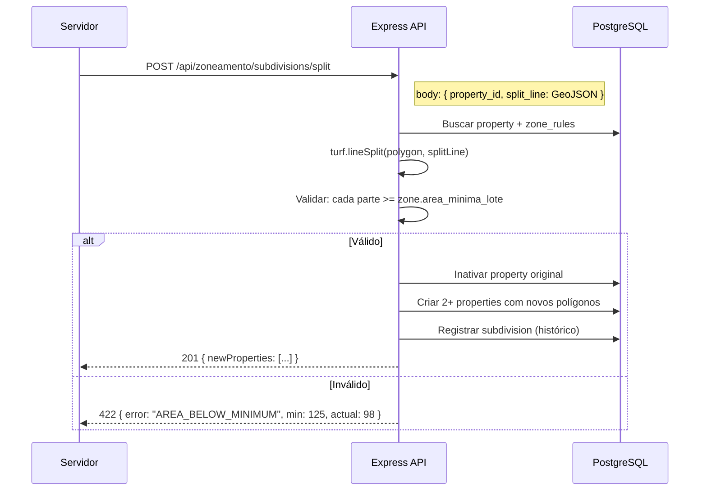

# SDD-05 — Domínio: Zoneamento e Urbanismo

## 1. Modelo de Dados do Domínio

> Tabelas no database do tenant. Geometrias de zonas em `MultiPolygon(4674)` para suportar zonas descontínuas.

---

## 2. Design Técnico

### 2.1 Zoneamento

---

#### DES-05-001 — Gestão de Zonas no Mapa
**Derives:** REQ-05-001

**Visão geral:** CRUD de zonas com polígonos no mapa, parâmetros urbanísticos e renderização visual com cores distintas.

**Endpoints:**
- `POST /api/zoneamento/zones` — criar zona (código, nome, geom GeoJSON, cor)
- `PUT /api/zoneamento/zones/:id` — editar zona
- `GET /api/zoneamento/zones` — listar todas (GeoJSON FeatureCollection)
- `PUT /api/zoneamento/zones/:id/rules` — atualizar parâmetros urbanísticos

**Detecção de sobreposição:**
- Na criação/edição: `SELECT id, nome FROM zones WHERE ST_Intersects(geom, :new_geom) AND id != :current_id`.
- Se houver interseção: retorna warning `{ overlaps: [{ zone_id, zone_name }] }` (não bloqueia, apenas informa).

**Frontend:** Zonas renderizadas como `GeoJSON` layer no Leaflet com `fillColor` e `fillOpacity` da tabela.

**Segurança:** `zoneamento.zone.admin`.

---

#### DES-05-002 — Regras de Permissibilidade
**Derives:** REQ-05-002

**Implementação:**
- CRUD: `/api/zoneamento/zones/:id/permissibilities`.
- Cada registro: `uso` (enum configurável), `classificacao` (permitido/permissível/proibido), `condicoes` (texto livre).
- Usos padrão no seed: residencial_uni, residencial_multi, comercial, industrial, serviços, misto.
- Admin pode criar novos tipos de uso via `/api/admin/zone-use-types`.

---

#### DES-05-003 — Consulta de Zoneamento por Imóvel
**Derives:** REQ-05-003

**Implementação:**
- `GET /api/zoneamento/by-property/:propertyId`
- Query: `SELECT z.* FROM zones z JOIN properties p ON ST_Contains(z.geom, p.geom) WHERE p.id = :propertyId`.
- Retorna: zona(s), regras e permissibilidades.
- Se imóvel sem geometria ou sem zona: `{ zone: null, message: "Zoneamento não definido" }`.
- Se em interseção de zonas: retorna array com todas as zonas aplicáveis.

---

### 2.2 Parcelamento de Solo

---

#### DES-05-004 — Desmembramento de Lotes
**Derives:** REQ-05-004

**Visão geral:** Servidor desenha linha(s) de divisão sobre o polígono do lote. Backend valida áreas mínimas, gera novas inscrições e atualiza polígonos.

**Arquitetura:**

- Cálculo de divisão: `turf.lineSplit()` no backend (server-side para consistência).
- Novas inscrições: geradas pelo `propertyService.generateInscricao()` (formato configurável por tenant).
- Histórico: tabela `subdivisions` com JSONBs de origem e resultado.

**Segurança:** `zoneamento.subdivision.write`.

---

#### DES-05-005 — Remembramento de Lotes
**Derives:** REQ-05-005

**Implementação:**
- `POST /api/zoneamento/subdivisions/merge` — body: `{ property_ids: [id1, id2, ...] }`.
- Validação de contiguidade: `ST_Touches(geom1, geom2)` ou `ST_Intersects` entre todos os pares.
- Unificação: `ST_Union(geom1, geom2, ...)` gera polígono unificado.
- Lotes originais inativados; novo lote criado com nova inscrição.
- Erro 422 se lotes não contíguos: `{ error: "NOT_CONTIGUOUS" }`.

---

### 2.3 Planta Genérica de Valores

---

#### DES-05-006 — Planta Genérica de Valores
**Derives:** REQ-05-006

**Implementação:**
- CRUD: `/api/zoneamento/pgv`.
- `POST /api/zoneamento/pgv/bulk` — importação em massa via CSV/XLSX (BullMQ job).
- Formato CSV: `tipo;referencia_id;valor_m2;vigencia`.
- Comparativos: `GET /api/zoneamento/pgv/compare?vigencia_a=&vigencia_b=` retorna diff de valores.
- Valor por bairro: calculado via `AVG(valor_m2) GROUP BY bairro` dos logradouros.
- Ranking: `GET /api/zoneamento/pgv/ranking?tipo=logradouro|bairro&order=desc&limit=20`.

**Segurança:** `zoneamento.pgv.write` para edição; leitura disponível a qualquer servidor autenticado.
