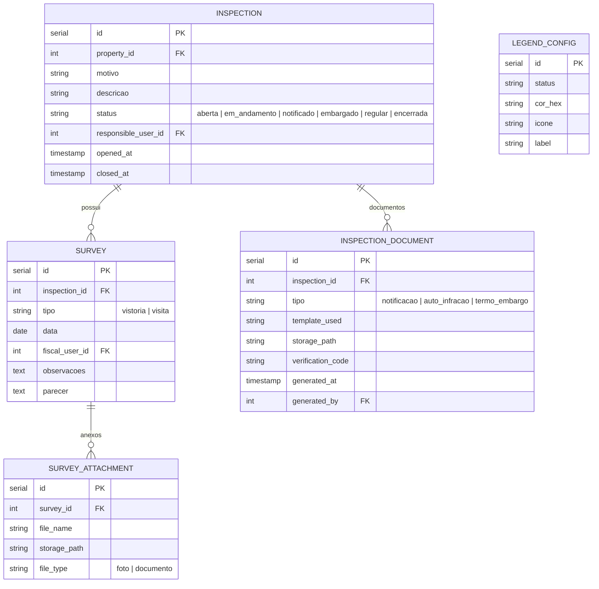
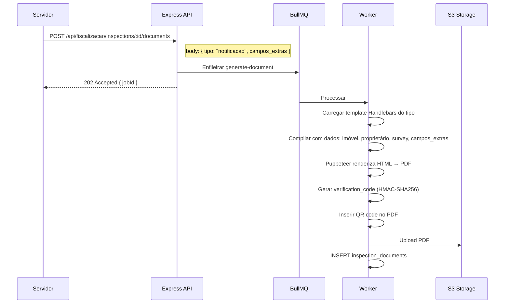

# SDD-06 — Domínio: Fiscalização

## 1. Modelo de Dados do Domínio

---

## 2. Design Técnico

### 2.1 Processo de Fiscalização

---

#### DES-06-001 — Abertura de Fiscalização
**Derives:** REQ-06-001

**Implementação:**
- `POST /api/fiscalizacao/inspections` — body: `{ property_id, motivo, descricao }`.
- `responsible_user_id` preenchido automaticamente do `req.user.id`.
- Status inicial: `aberta`.
- Motivos configuráveis: tabela `inspection_motives` (nome, descrição) — seed com padrões.
- Múltiplas fiscalizações por imóvel: sem constraint de unicidade em `property_id`.
- `GET /api/fiscalizacao/inspections?property_id=` — histórico por imóvel.
- `GET /api/fiscalizacao/inspections/:id` — detalhe com surveys e documentos.

**Segurança:** `fiscalizacao.inspection.write`.

---

#### DES-06-002 — Registro de Vistorias e Visitas
**Derives:** REQ-06-002

**Implementação:**
- `POST /api/fiscalizacao/inspections/:id/surveys` — body: `{ tipo, data, observacoes, parecer }`.
- `tipo = 'visita'`: campos simplificados (sem parecer obrigatório).
- `tipo = 'vistoria'`: parecer obrigatório.
- Anexos: `POST /api/fiscalizacao/surveys/:sid/attachments` — multipart upload → S3.
- Storage: `/{tenant_slug}/inspections/{inspection_id}/surveys/{survey_id}/{uuid}.{ext}`.
- Formatos aceitos: JPG, PNG, PDF (max 20MB).

---

#### DES-06-003 — Geração de Documentos de Fiscalização
**Derives:** REQ-06-003

**Visão geral:** Documentos gerados via Puppeteer a partir de templates Handlebars configuráveis por tenant.

**Arquitetura:**

- Templates: tabela `document_templates` — `tipo`, `template_html`, configurável pelo admin.
- Dados injetados: `{{ property.endereco }}`, `{{ property.proprietario }}`, `{{ survey.observacoes }}`, `{{ survey.parecer }}`.
- Código de verificação: `HMAC-SHA256(doc_id + timestamp, SECRET)` truncado em 12 chars.
- Endpoint público de verificação: `GET /api/public/verify/:code`.

---

### 2.2 Visualização e Indicadores

---

#### DES-06-004 — Legendas e Status no Mapa
**Derives:** REQ-06-004

**Implementação:**
- Tabela `legend_config`: status → cor + ícone + label (configurável pelo admin).
- `GET /api/fiscalizacao/map-features?bbox=&status=` — retorna GeoJSON com imóveis fiscalizados:
  - JOIN: `inspections` → `properties` (onde `geom IS NOT NULL`).
  - Cada feature inclui `properties: { status, cor, icone }`.
- Frontend: camada Leaflet dedicada com `L.circleMarker` ou `L.divIcon` colorido por status.
- Filtro por status: query parameter `status=embargado,notificado` (multi-value).

**Segurança:** Camada visível a servidores autenticados (não no Portal do Cidadão).

---

#### DES-06-005 — Indicadores por Bairro
**Derives:** REQ-06-005

**Implementação:**
- `GET /api/fiscalizacao/indicators?type=construcoes|area|baldios|itbi&period=`

**Queries por tipo:**

| Indicador | Query |
|-----------|-------|
| Construções | `SELECT bairro, COUNT(*) FROM properties WHERE area_construida > 0 GROUP BY bairro` |
| Área construída | `SELECT bairro, SUM(area_construida) FROM properties GROUP BY bairro` |
| Lotes baldios | `SELECT bairro, COUNT(*) FROM properties WHERE tipo = 'lote' AND area_construida = 0 GROUP BY bairro` |
| ITBIs | Dados via integração ERP (tabela `itbi_requests` ou endpoint ERP) com filtro de período |

- Resultado: `[{ bairro, value, rank }]` ordenado por valor.
- Visualização no mapa: `GET /api/fiscalizacao/indicators/geojson?type=` → retorna polígonos de bairros com valor para escala de cores (choropleth).
- Polígonos de bairros: derivados de `GROUP BY bairro` das geometrias de imóveis (`ST_ConvexHull(ST_Collect(geom))`).

**Dados de ITBI:** Se via integração ERP, exibir aviso `"Dados podem estar desatualizados"` quando `integration_status.status != 'online'`.
