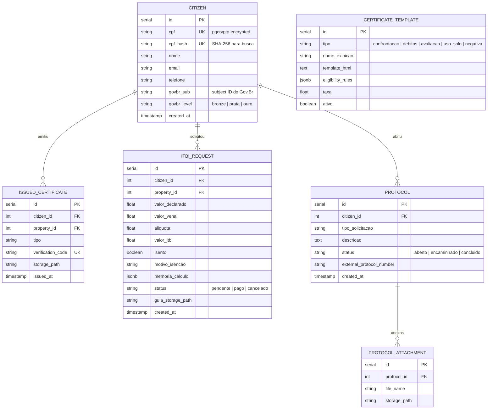
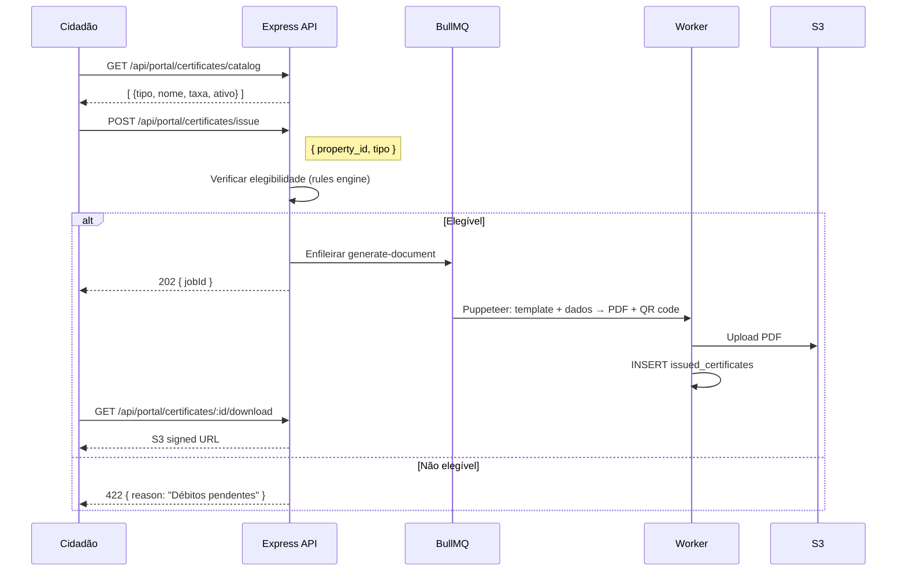

# SDD-07 — Domínio: Portal do Cidadão

## 1. Modelo de Dados do Domínio



---

## 2. Design Técnico

### 2.1 Acesso e Autenticação

---

#### DES-07-001 — Acesso Web ao Portal
**Derives:** REQ-07-001

**Implementação:**
- React SPA servida via Nginx (build Vite separado ou rota do mesmo build com flag `PORTAL_MODE`).
- Rotas públicas (sem auth): `/portal`, `/portal/busca`, `/portal/mapa`.
- Rotas autenticadas: `/portal/meus-imoveis`, `/portal/certidoes`, `/portal/itbi`, `/portal/protocolos`.
- React Router com `<ProtectedRoute>` que verifica sessão via `GET /api/portal/me` (retorna 401 se não autenticado).
- Responsivo: Tailwind breakpoints `sm/md/lg`.

---

#### DES-07-002 — Acesso Anônimo
**Derives:** REQ-07-002

**Implementação:**
- Endpoints públicos (sem `authMiddleware`):
  - `GET /api/portal/properties/search?q=&field=endereco|inscricao|matricula`
  - `GET /api/portal/layers` (apenas camadas com `visible_portal = true`)
  - `GET /api/portal/properties/:id/public` (dados públicos: endereço, área, zoneamento)
- Tentativa de acessar endpoint restrito → 401 → frontend redireciona para `/portal/login`.
- Banner de privacidade: componente `<CookieConsentBanner>` (DES-01-003).

---

#### DES-07-003 — Acesso Autenticado com Imóveis Vinculados
**Derives:** REQ-07-003

**Implementação:**
- Login inicia fluxo OIDC (DES-07-004) ou login local (CPF + senha).
- Após autenticação, sessão Redis armazena: `{ citizen_id, cpf_hash, nome, permissions }`.
- `GET /api/portal/me/properties` — busca imóveis por `cpf_hash` (JOIN `properties` onde hash do CPF descriptografado = `cpf_hash` da sessão).
- Frontend: `useMyProperties()` hook carrega imóveis e centraliza mapa.
- Termo de Uso: middleware `termsCheckMiddleware` (DES-01-002) aplicado em rotas autenticadas do portal.

---

#### DES-07-004 — Login via Gov.Br
**Derives:** REQ-07-004

**Implementação:**
- Biblioteca `openid-client` com OIDC Discovery: `https://sso.acesso.gov.br/.well-known/openid-configuration`.
- Credenciais (`client_id`, `client_secret`) em `geo_control.tenant_config` por tenant.
- Fluxo Authorization Code + PKCE:
  1. `GET /api/portal/auth/govbr/login` → redirect para Gov.Br.
  2. `GET /api/portal/auth/govbr/callback` → troca code por tokens → extrai `sub`, `cpf`, `name`, nível.
  3. Upsert `citizens` (cria se não existe, atualiza `govbr_sub` e `govbr_level`).
  4. Cria sessão Redis.
- Fallback: se Gov.Br indisponível, login local (CPF + senha) permanece disponível.
- Logout: `GET /api/portal/auth/logout` → destrói sessão Redis → redirect `end_session_endpoint` do Gov.Br.

---

#### DES-07-005 — Captcha Cloudflare Turnstile
**Derives:** REQ-07-005

**Implementação:**
- Frontend: `@cloudflare/turnstile` widget renderizado em formulários: login, abertura de protocolo, solicitação ITBI.
- `site_key` carregada de `GET /api/portal/config` (público, por tenant).
- Backend: middleware `turnstileMiddleware` valida token via `POST https://challenges.cloudflare.com/turnstile/v0/siteverify` com `secret_key` do `geo_control.tenant_config`.
- Se Turnstile indisponível: middleware bypassa (degradação graciosa, logando o evento).

---

### 2.2 Consulta e Serviços

---

#### DES-07-006 — Consulta de Imóveis pelo Cidadão
**Derives:** REQ-07-006

**Implementação:**
- Endpoint público: `GET /api/portal/properties/search` — retorna dados públicos.
- Endpoint autenticado: `GET /api/portal/properties/:id/full` — retorna dados completos se cidadão é proprietário.
- Controle de visibilidade no repository:

```typescript
// portalPropertyRepository.ts
async getPublicData(id: number) {
  return prisma.property.findUnique({
    where: { id },
    select: { endereco: true, bairro: true, area_terreno: true, tipo: true }
    // CPF, nome proprietário EXCLUÍDOS
  });
}
async getFullData(id: number, citizenCpfHash: string) {
  const prop = await prisma.property.findUnique({ where: { id } });
  if (hashCpf(decrypt(prop.proprietario_cpf_cnpj)) !== citizenCpfHash) {
    throw new ForbiddenError('Acesso restrito ao proprietário');
  }
  return prop; // dados completos
}
```

---

#### DES-07-007 — Emissão de Certidões Online
**Derives:** REQ-07-007

**Visão geral:** Cidadão seleciona tipo de certidão → sistema verifica elegibilidade → gera PDF via Puppeteer → disponibiliza download.

**Arquitetura:**



- Catálogo: `GET /api/portal/certificates/catalog` — apenas templates com `ativo = true`.
- Elegibilidade: `eligibility_rules` (JSONB) interpretadas por engine simples:
  - `{ "no_debts": true }` → verifica ausência de débitos (via ERP ou tabela local).
  - `{ "owner_only": true }` → verifica que cidadão é proprietário.
- Verificação pública: `GET /api/public/verify/:code` — busca em `issued_certificates.verification_code`.

---

#### DES-07-008 — Solicitação de ITBI
**Derives:** REQ-07-008

**Implementação:**
- `POST /api/portal/itbi` — body: `{ property_id, valor_declarado, comprador, vendedor }`.
- Cálculo:
  1. Obter `valor_venal` do imóvel via `pgvService.getValorVenal(property_id)`.
  2. Carregar `itbi_config` do tenant (alíquota, base_calc_rule, isenções).
  3. `base = Math.max(valor_declarado, valor_venal)` (ou conforme `base_calc_rule`).
  4. Verificar isenções.
  5. `valor_itbi = base * aliquota`.
- Memória de cálculo: JSONB com todos os inputs e resultado.
- Guia: BullMQ `generate-document` → PDF com dados da transação e valor.
- `GET /api/portal/itbi/:id` — status e download da guia.

---

#### DES-07-009 — Interação com Fiscalizações
**Derives:** REQ-07-009

**Implementação:**
- `GET /api/portal/inspections` — lista fiscalizações dos imóveis do cidadão (via `cpf_hash` → `properties` → `inspections`).
- `GET /api/portal/inspections/:id` — detalhe: motivo, status, documentos emitidos (PDFs).
- `POST /api/portal/inspections/:id/responses` — body: `{ texto, attachments[] }`.
  - Tabela `inspection_responses`: `inspection_id`, `citizen_id`, `texto`, `created_at`.
  - Anexos via multipart → S3.
  - EventEmitter notifica servidor fiscal (futuro: email/push).

---

#### DES-07-010 — Abertura de Protocolos
**Derives:** REQ-07-010

**Implementação:**
- `POST /api/portal/protocols` — body: `{ tipo_solicitacao, descricao, attachments[] }`.
- Tipos configuráveis: tabela `protocol_types` (nome, descrição).
- Número de protocolo: gerado sequencialmente (`SERIAL` ou `YYYYMMDD-NNNN`).
- Integração com sistema terceiro (se configurado em `tenant_config.protocol_integration`):
  - `protocolIntegrationService.forward(protocol)` → POST para API externa → armazena `external_protocol_number`.
  - Se API falha: protocolo salvo localmente com `status = 'pendente_encaminhamento'`; retentativa via `node-cron`.
- Captcha Turnstile obrigatório neste formulário (DES-07-005).

---

### 2.3 Visualização

---

#### DES-07-011 — Camadas Públicas e Impressão
**Derives:** REQ-07-011

**Implementação:**
- Camadas: `GET /api/portal/layers` retorna apenas layers com `visible_portal = true`.
- Frontend: painel lateral com toggles por camada (Zustand store `usePortalLayers`).
- Impressão: reutiliza `<MapExport>` (DES-03-011) com polígono do imóvel destacado.
- Formatos: PNG e PDF (A4) — gerados client-side via `leaflet-image` + `jsPDF`.
