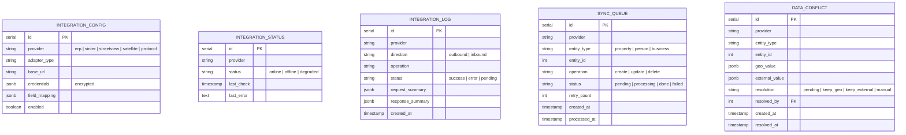
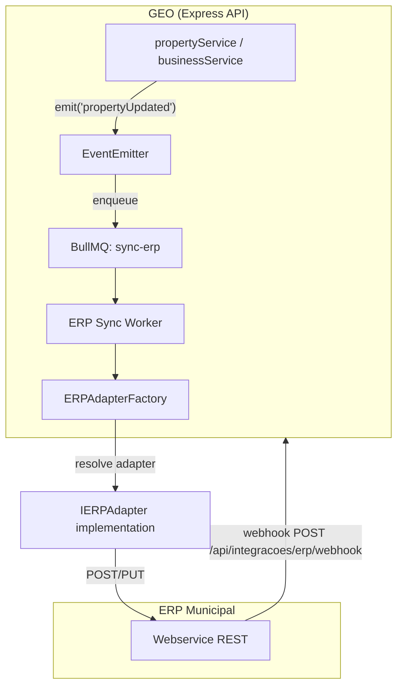
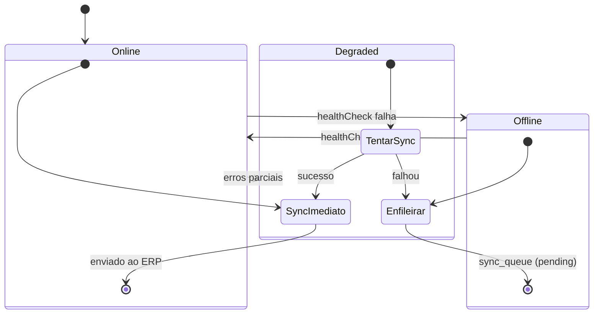

# SDD-08 — Domínio: Integrações

## 1. Modelo de Dados do Domínio



> Tabelas no database do tenant. `credentials` criptografadas via `pgcrypto`.

---

## 2. Design Técnico

### 2.1 Integração com ERP Municipal

---

#### DES-08-001 — Integração Bidirecional com ERP Municipal
**Derives:** REQ-08-001

**Visão geral:** Adapter pattern para conectar a diferentes ERPs. Sincronização via webhooks (inbound) e fila BullMQ (outbound).

**Arquitetura:**



**Interface do adapter:**

```typescript
interface IERPAdapter {
  syncProperty(data: PropertyDTO): Promise<SyncResult>;
  syncPerson(data: PersonDTO): Promise<SyncResult>;
  syncBusiness(data: BusinessDTO): Promise<SyncResult>;
  fetchProperty(externalId: string): Promise<PropertyDTO>;
  healthCheck(): Promise<boolean>;
}
```

- **Outbound (GEO → ERP):** `propertyService` emite evento → listener enfileira job `sync-erp` → worker resolve adapter via `ERPAdapterFactory.create(tenantConfig)` → adapter traduz e envia.
- **Inbound (ERP → GEO):** Webhook `POST /api/integracoes/erp/webhook` recebe payload → adapter traduz para formato interno → service atualiza cadastro.
- **Polling (fallback):** `node-cron` job periódico consulta ERP por alterações recentes (para ERPs sem webhook).
- **Logs:** Toda transação registrada em `integration_logs`.

**Segurança:** Webhook autenticado via HMAC signature ou API key no header. Config admin: `integracoes.config.admin`.

---

#### DES-08-002 — Resolução de Conflitos GEO-ERP
**Derives:** REQ-08-002

**Implementação:**
- Detecção: durante sync inbound, worker compara dados recebidos com dados locais. Se diferem e ambos foram alterados desde o último sync → cria `data_conflict`.
- `GET /api/admin/conflicts?status=pending` — lista conflitos pendentes.
- `PUT /api/admin/conflicts/:id/resolve` — body: `{ resolution: 'keep_geo' | 'keep_external' | 'manual', manual_value? }`.
- Regras automáticas: tabela `conflict_rules` — ex.: `{ entity_type: 'property', field: 'proprietario', rule: 'keep_external' }` → resolve sem intervenção.
- Após resolução, sync propagado ao lado perdedor.

---

#### DES-08-003 — Modo Degradado de Integração
**Derives:** REQ-08-003

**Implementação:**
- Health check: `node-cron` a cada 5min executa `adapter.healthCheck()` → atualiza `integration_status`.
- Se `status = 'offline'`:
  - Operações GEO continuam normalmente (sem bloqueio).
  - Alterações que seriam sincronizadas são enfileiradas em `sync_queue` com `status = 'pending'`.
  - Admin notificado via WebSocket push.
  - UI exibe badge "ERP Offline" para servidores.
- Quando ERP retorna (`status = 'online'`):
  - Worker processa `sync_queue` em ordem cronológica.
  - Conflitos detectados durante processamento da fila → `data_conflicts`.



---

### 2.2 Integração com SINTER

---

#### DES-08-004 — Integração com SINTER/CIB
**Derives:** REQ-08-004

**Implementação:**
- `sinterService.ts` implementa `ISinterClient` com métodos: `requestCIB(property)`, `sendUpdate(property)`.
- Schema mapping: arquivo `sinter-schema-v{N}.json` mapeando campos GEO → payload SINTER.
- Versão da API: `tenant_config.sinter_api_version` ou config global.
- **Novo imóvel:** EventEmitter `propertyCreated` → BullMQ `sync-sinter` → `requestCIB()`.
- **Atualização:** EventEmitter `propertyUpdated` (campos relevantes: área, proprietário, endereço) → `sendUpdate()`.
- Retry: `axios-retry` 3x com backoff exponencial (1min, 5min, 15min).
- CIB retornado: `UPDATE properties SET cib = :cib, cib_pending = false`.
- Falha: `cib_pending = true`; `GET /api/admin/sinter/pending` lista imóveis sem CIB.
- Logs em `integration_logs` (provider = 'sinter').

---

### 2.3 Integração com Serviços de Imagem

---

#### DES-08-005 — Integração com Google Street View
**Derives:** REQ-08-005

**Implementação:**
- 100% client-side via Google Maps Embed API (iframe).
- Frontend: `<StreetViewPanel lat={lat} lng={lng} />` → renderiza iframe:
  `https://www.google.com/maps/embed/v1/streetview?location={lat},{lng}&key={apiKey}`.
- `apiKey` carregada de `tenant_config.google_streetview_key` via `GET /api/portal/config`.
- Se key não configurada: componente não renderiza.
- Disponível em módulo servidor e portal do cidadão.

---

#### DES-08-006 — Importação de Imagens de Satélite
**Derives:** REQ-08-006

**Implementação:**
- Strategy pattern: `ISatelliteProvider` com duas implementações:
  - `FileImportProvider`: admin faz upload de GeoTIFF → S3 → registro em `satellite_images`.
  - `APISatelliteProvider`: consome API de provedor externo → download → S3.
- `POST /api/integracoes/satellite/upload` (admin) — multipart GeoTIFF.
- Validação: verificar metadata EXIF/GeoTIFF para georreferenciamento e datum.
- Se datum ≠ SIRGAS 2000: conversão via GDAL `gdalwarp -t_srs EPSG:4674`.
- Catálogo: `GET /api/cartografia/satellite/catalog?bbox=&date_from=&date_to=`.

---

### 2.4 Integração com Protocolo

---

#### DES-08-007 — Integração com Sistemas de Protocolo
**Derives:** REQ-08-007

**Implementação:**
- Config por tenant: `tenant_config.protocol_integration` — `{ mode: 'api' | 'link', base_url, credentials }`.
- **Modo `link`:** frontend redireciona cidadão para URL externa com parâmetros query.
- **Modo `api`:** `protocolIntegrationService.forward(protocol)`:
  1. `POST {base_url}/protocolos` com dados mapeados.
  2. Resposta → `external_protocol_number` armazenado no registro.
  3. Falha → `protocol.status = 'pendente_encaminhamento'`; retentativa via `node-cron` a cada 15min.
- Log em `integration_logs` (provider = 'protocol').
- Admin pode testar integração: `POST /api/admin/protocol-integration/test`.
