# TSD-02 — Deploy e Implantação do Produto GEO

## 4.1 Infraestrutura do Produto

### Sizing Inicial

| Componente | Dev | Staging | Production |
|-----------|-----|---------|------------|
| API (Node.js) | 1 container, 512MB | 2 pods, 1GB each | 2–4 pods, 2GB each, HPA |
| Worker (BullMQ) | Mesmo processo | 1 pod, 1GB | 1–2 pods, 2GB |
| PostgreSQL (controle) | Docker, 256MB | Managed, 1 vCPU, 2GB | Managed, 2 vCPU, 8GB |
| PostgreSQL (por tenant) | Docker, 256MB shared | Managed, shared instance | Managed, shared ou dedicado |
| Redis | Docker, 128MB | Managed, 1GB | Managed, 2GB |
| S3 / MinIO | MinIO Docker | S3 bucket | S3 bucket |
| Nginx | Docker | K8s Ingress | K8s Ingress + CDN |

### Critérios de Scaling

- **API pods:** HPA baseado em CPU > 70% ou latência p99 > 2s.
- **Tenant DB:** Monitorar conexões ativas; considerar instância dedicada se tenant > 50k imóveis.
- **Redis:** Monitorar memória; scaling vertical.

---

## 4.2 Configuração por Ambiente

### Variáveis de Ambiente

| Variável | Descrição | Exemplo |
|----------|-----------|---------|
| `NODE_ENV` | Ambiente | `production` |
| `PORT` | Porta da API | `3000` |
| `CONTROL_DATABASE_URL` | URL do banco de controle | `postgres://...geo_control` |
| `REDIS_URL` | URL do Redis | `redis://localhost:6379` |
| `S3_ENDPOINT` | Endpoint S3/MinIO | `https://s3.amazonaws.com` |
| `S3_BUCKET` | Bucket principal | `geo-storage` |
| `S3_ACCESS_KEY` | Chave S3 | `***` |
| `S3_SECRET_KEY` | Secret S3 | `***` |
| `ENCRYPTION_KEY` | Chave pgcrypto (base64 32 bytes) | `***` |
| `SESSION_SECRET` | Secret do express-session | `***` |
| `OIDC_ISSUER` | Issuer OIDC interno (servidores) | `https://auth.geo.app` |
| `RATE_LIMIT_TILES_PER_MIN` | Rate limit tiles | `100` |
| `BACKUP_S3_BUCKET` | Bucket de backups | `geo-backups` |

> Credenciais OIDC Gov.Br e API keys (Google, Mapbox, Turnstile) ficam em `geo_control.tenant_config` por tenant.

### Feature Flags (tenant_config)

```jsonc
{
  "features": {
    "satellite_module": true,   // Módulo de satélite
    "govbr_login": true,        // Login Gov.Br
    "streetview": true           // Google Street View
  },
  "map_provider": "openstreetmap",
  "google_streetview_key": "...",
  "turnstile_site_key": "...",
  "turnstile_secret_key": "..."
}
```

---

## 4.3 Pipeline de CI/CD

```mermaid
graph LR
    PUSH["Push to main"] --> LINT["Lint + TypeCheck"]
    LINT --> TEST["Unit Tests\n(Vitest, ≥80% cov)"]
    TEST --> BUILD["Build\n(API + Web)"]
    BUILD --> DOCKER["Build Docker Image"]
    DOCKER --> SCAN["Security Scan\n(npm audit + Trivy)"]
    SCAN --> STAGING["Deploy Staging"]
    STAGING --> E2E["E2E Tests\n(Playwright)"]
    E2E --> APPROVE["Manual Approval"]
    APPROVE --> PROD["Deploy Production\n(Rolling Update)"]
    PROD --> HEALTH["Health Check\n(5min window)"]
    HEALTH -->|"Fail"| ROLLBACK["Auto Rollback"]
```



**Rollback automático:** Se `/api/health` retorna não-200 nos primeiros 5min → K8s reverte para revisão anterior.

**Migrations em deploy:**
1. CI aplica `prisma migrate deploy` no `geo_control`.
2. CI executa `migrate-all-tenants.ts` que itera sobre `tenants` e aplica migrations em cada database.
3. Se qualquer migration falhar → deploy abortado, rollback.

---

## 4.4 Schema de Dados

### Modelo Físico — Database de Controle (`geo_control`)

| Tabela | Colunas principais | Índices |
|--------|-------------------|---------|
| `tenants` | id, slug (UK), name, db_name (UK), db_host, status | slug, db_name |
| `tenant_config` | tenant_id (PK/FK), config (JSONB) | — |
| `onboarding_progress` | tenant_id, step, completed, completed_at | tenant_id + step |

### Modelo Físico — Database de Tenant (resumo)

Cada tenant DB contém todas as tabelas de domínio (ver SDDs 03–08). Tabelas compartilhadas:

| Tabela | Domínio | Índices principais |
|--------|---------|--------------------|
| `users` | Auth | email (UK) |
| `roles`, `permissions`, `role_permissions`, `user_roles` | Auth | role_id, user_id |
| `terms_of_use`, `term_acceptances` | Auth | user_id + term_version |
| `audit_logs` | Shared | timestamp (partition key), user_id, entity_type |
| `layers`, `polygons` | Cartografia | GiST on geom, layer_id |
| `properties` | Cadastro | inscricao_imobiliaria (UK), GiST on geom |
| `businesses` | Cadastro | cnpj (UK), property_id |
| `streets`, `pois` | Cadastro | nome (FTS), GiST on geom |
| `zones`, `zone_rules`, `zone_permissibilities` | Zoneamento | GiST on geom, zone_id |
| `inspections`, `surveys` | Fiscalização | property_id, inspection_id |
| `citizens` | Portal | cpf_hash (UK), govbr_sub |
| `certificate_templates`, `issued_certificates` | Portal | tipo, verification_code (UK) |
| `integration_config`, `integration_logs`, `sync_queue` | Integrações | provider, status |

### Estratégia de Migrations

- **Ferramenta:** Prisma Migrate.
- **Versionamento:** Diretório `prisma/migrations/` commitado no repositório.
- **Multi-tenant deploy:** Script `migrate-all-tenants.ts`:
  1. Lista tenants ativos em `geo_control`.
  2. Para cada tenant, instancia PrismaClient com URL do tenant DB.
  3. Executa `prisma migrate deploy`.
  4. Registra resultado (sucesso/erro) em log.
- **Rollback:** Nova migration que reverte (não há `prisma migrate down`).
- **Database template:** Após cada migration, atualizar `geo_template` para novos tenants.

---

## 4.5 Especificações de API

### Versionamento
- URL path: `/api/v1/...` (v1 implícito na v1 — path `/api/...` = v1).
- Versionamento futuro via header `Accept-Version` ou path `/api/v2/...`.

### Estrutura de Resposta Padrão

```jsonc
// Sucesso
{ "data": { ... }, "meta": { "page": 1, "limit": 20, "total": 150 } }

// Erro
{ "error": { "code": "VALIDATION_ERROR", "message": "...", "details": [...] } }
```

### Rate Limiting

| Tipo de endpoint | Limite | Scope |
|-----------------|--------|-------|
| Autenticação (`/api/auth/*`) | 10 req/min | Por IP |
| Tiles/imagens | 100 req/min | Por IP |
| API geral (autenticado) | 300 req/min | Por sessão |
| API pública (anônimo) | 60 req/min | Por IP |
| Webhooks ERP | 100 req/min | Por tenant |

---

## 4.6 Integrações Externas

| Integração | Circuit Breaker | Fallback | SLA esperado |
|-----------|----------------|----------|-------------|
| ERP Municipal | 3 falhas em 1min → open (5min) | Enfileira em `sync_queue` | Variável por município |
| SINTER | 3 falhas → open (15min) | `cib_pending = true`; retentativa | Indefinido (governo) |
| Gov.Br OIDC | 2 falhas → open (5min) | Login local (CPF + senha) | 99.5% |
| Google Street View | Sem circuit breaker | Mensagem "não disponível" | 99.9% |
| Cloudflare Turnstile | Sem circuit breaker | Bypass (degradação graciosa) | 99.99% |

---

## 4.7 Observabilidade

### Logging
- **Formato:** JSON estruturado (pino ou winston).
- **Campos:** `timestamp`, `level`, `module`, `tenant_slug`, `user_id`, `request_id`, `message`, `data`.
- **Níveis:** `error` → alerta; `warn` → atenção; `info` → operações normais; `debug` → dev only.
- **Retenção:** 30 dias em staging; 90 dias em production.

### Health Endpoints

| Endpoint | Verifica | Usado por |
|----------|---------|-----------|
| `GET /api/health` | App está viva | K8s liveness probe |
| `GET /api/ready` | PostgreSQL control + Redis conectados | K8s readiness probe |
| `GET /api/admin/status` | Status detalhado (DB, Redis, S3, integrações) | Dashboard admin |

### Alertas Críticos

| Alerta | Condição | Ação |
|--------|----------|------|
| API down | Health check falha 3x seguidas | Notificar ops (email/Slack) |
| Tenant DB inacessível | Health check do tenant falha | Notificar ops + admin do tenant |
| Fila BullMQ saturada | > 1000 jobs pendentes em qualquer fila | Investigar worker |
| ERP offline > 1h | `integration_status.status = 'offline'` > 1h | Notificar admin do tenant |

---

## 4.8 Estratégias de Teste

| Tipo | Ferramenta | Cobertura/Escopo |
|------|-----------|-----------------|
| Unit | Vitest | ≥ 80% de cobertura em services e repositories |
| Integration | Vitest + supertest | Endpoints API com banco de teste real (PostgreSQL) |
| E2E | Playwright | Fluxos críticos: login, consulta imóvel, emissão certidão, fiscalização |
| Carga | k6 | API suporta 100 req/s com p99 < 2s; mapa carrega < 3s |

### Dados de Teste
- **Seed:** `prisma db seed` com 1 tenant demo, 1000 imóveis, 50 zonas, 100 empresas.
- **Geoespacial:** GeoJSON fixture com polígonos de teste em SIRGAS 2000.
- **Isolamento:** Cada suite de integração cria tenant temporário e destrói ao final.

---

## 4.9 Segurança Operacional

- **Secrets:** Variáveis de ambiente via K8s Secrets (encriptados em etcd) ou vault.
- **Rotação:** `ENCRYPTION_KEY` e `SESSION_SECRET` rotáveis com re-encrypt script.
- **SAST:** `npm audit` no CI; falha em vulnerabilidades high/critical.
- **Container scan:** Trivy no build da imagem Docker.
- **Acesso a ambientes:** staging/production via kubectl com RBAC do cluster.
- **TLS:** Obrigatório em staging e production (cert-manager + Let's Encrypt).

---

## 5. Especificações de Implementação do Produto

### 5.1 Conformidade

---

#### IMP-02-001 — LGPD para Dados Cadastrais
**Derives:** DES-02-001
**Deploy:** Reusa infra de DES-01-009 a DES-01-013. Sem migration adicional.
**Testes:** Integration: export de imóveis mascara CPF para perfil não-admin.

---

#### IMP-02-002 — Conformidade SINTER
**Derives:** DES-02-002
**Env vars:** Nenhuma — config SINTER em `tenant_config`.
**Testes:** Integration: mock SINTER API; verifica schema do payload enviado.

---

#### IMP-02-003 — Atribuição CIB
**Derives:** DES-02-003
**Deploy:** Fila BullMQ `sync-sinter` configurada com 3 retries, backoff exponencial.
**Testes:** Integration: criar imóvel → verificar job enfileirado → mock SINTER retorna CIB → verificar CIB salvo.

---

#### IMP-02-004 — SIRGAS 2000
**Derives:** DES-02-004
**Deploy:** `geo_template` criado com `CREATE EXTENSION postgis;` e SRID 4674. GDAL instalado no container.
**Testes:** Unit: importar SHP em SAD69 → verificar conversão para 4674. Integration: coordenadas retornadas pela API em SIRGAS 2000.

---

#### IMP-02-005 — Validade de Documentos
**Derives:** DES-02-005
**Migrations:** `012_create_document_templates`, `013_create_issued_certificates`.
**Deploy:** Puppeteer requer Chromium — usar `puppeteer-core` + Chromium pré-instalado no container.
**Testes:** Integration: gerar certidão → verificar PDF válido → verificar código via endpoint público.

---

### 5.2 Regulamentos

---

#### IMP-02-006 — Parcelamento de Solo
**Derives:** DES-02-006
**Testes:** Unit: `MinAreaSpec(125).isSatisfiedBy(100)` retorna false. Integration: desmembramento com área < mínimo retorna 422.

---

#### IMP-02-007 — Zoneamento Configurável
**Derives:** DES-02-007
**Migrations:** `014_create_zones`, `015_create_zone_rules`, `016_create_zone_permissibilities`.
**Índices:** GiST on `zones.geom`.
**Testes:** Integration: criar zona → consultar imóvel dentro → retorna zona correta.

---

#### IMP-02-008 — Restrições Ambientais
**Derives:** DES-02-008
**Migrations:** `017_create_environmental_restrictions`.
**Testes:** Integration: adicionar restrição APP → visível na consulta do imóvel.

---

#### IMP-02-009 — ITBI
**Derives:** DES-02-009
**Migrations:** `018_create_itbi_config`, `019_create_itbi_requests`.
**Seed:** Config padrão: alíquota 2%, base = max(declarado, venal).
**Testes:** Unit: cálculo com valor declarado > venal; cálculo com isenção; cálculo com venal > declarado.

---

### 5.3 Resiliência

---

#### IMP-02-010 — Validação Base Cartográfica
**Derives:** DES-02-010
**Migrations:** `020_create_import_jobs`.
**Deploy:** GDAL `ogr2ogr` disponível no container.
**Testes:** Integration: upload SHP em SAD69 → job processa → polígonos em SRID 4674.

---

#### IMP-02-011 — Conectividade ERP
**Derives:** DES-02-011
**Migrations:** `021_create_integration_status`.
**Deploy:** `node-cron` job a cada 5min.
**Testes:** Integration: mock ERP offline → status = 'offline'; mock ERP online → status = 'online'.

---

#### IMP-02-012 — Onboarding
**Derives:** DES-02-012
**Migrations:** Tabela `onboarding_progress` já em `geo_control`.
**Testes:** E2E: novo tenant → wizard aparece → completar steps → wizard não reaparece.

---

#### IMP-02-013 — Abstração Satélite
**Derives:** DES-02-013
**Testes:** Unit: `FileImportProvider.getAvailableImages()` retorna imagens do S3. Strategy resolve provider correto.

---

#### IMP-02-014 — Operação Parcial
**Derives:** DES-02-014
**Testes:** Integration: imóvel sem geometria retornado por busca textual; dashboard mostra coverage < 100%.

---

#### IMP-02-015 — Adaptadores ERP
**Derives:** DES-02-015
**Migrations:** `022_create_integration_config`.
**Deploy:** Credentials criptografadas via `pgcrypto`.
**Testes:** Unit: factory resolve adapter correto por `adapter_type`. Integration: sync com mock ERP.

---

#### IMP-02-016 — Versionamento SINTER
**Derives:** DES-02-016
**Deploy:** Schemas JSON em `src/modules/integracoes/sinter-schemas/`.
**Testes:** Unit: v1 e v2 schemas mapeiam campos corretamente.

---

#### IMP-02-017 — Satélite Opcional
**Derives:** DES-02-017
**Testes:** Integration: feature flag off → rotas de satélite retornam 404; flag on → rotas funcionam.
